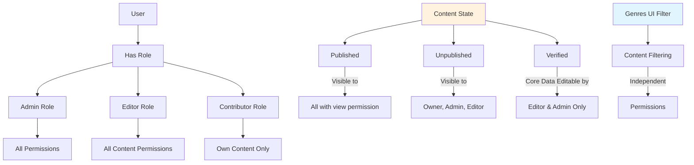

# Final Roles and Permissions System Design

## Overview
This document outlines the final design for implementing a comprehensive role-based permission system using Spatie Laravel Permission package. **Important**: Genres are NOT used in permissions. Genres are purely UI filters for genres and have no relationship to the permission system.

## Current State Analysis
- Spatie Laravel Permission package is installed but not utilized
- Admin access is determined by email matching `ADMIN_EMAIL` config
- Policies exist for core resources but use simple ownership checks
- Permission tables exist but are empty
- User model already has `HasRoles` trait
- Genres exist as a separate system for content filtering (organist, guitarist, other genres)

## Key Clarification: Genres vs Permissions
- **Genres**: UI filters for genres (organist, guitarist, other). Users (including guests) can set a genre filter to view content filtered by genre. No permission system is needed for genres.
- **Permissions**: Control access to create, read, update, delete, publish, unpublish, and verify resources. Completely separate from genres.

## Role Definitions

### 1. Admin
- **Description**: Full system access, can manage all resources and users
- **Permissions**: All permissions
- **Use Case**: System administrators, super users
- **Special Notes**: Can see and edit unpublished content

### 2. Editor  
- **Description**: Can create, edit, publish, unpublish, and verify content. Can manage any content regardless of ownership.
- **Permissions**: All content permissions (create, read, update, delete, publish, unpublish, verify)
- **Use Case**: Content moderators, senior contributors
- **Special Notes**: Can edit "verified" content's core data (locked for Contributors)

### 3. Contributor
- **Description**: Can create and manage their own content, publish/unpublish their own content
- **Permissions**: Create content, edit own content (unless verified), publish/unpublish own content
- **Use Case**: Regular users, content creators
- **Special Notes**: Cannot edit "verified" content's core data, cannot edit other users' content

## Content States and Permissions

### 1. Unpublished Content
- **Visibility**: Owner, Admin, Editors
- **Editing**: Owner can edit, Admin/Editors can edit
- **Publishing**: Owner can publish, Editors can publish

### 2. Published Content
- **Visibility**: All authenticated users (based on view permissions)
- **Editing**: Owner can edit/unpublish, Editors can edit/unpublish, Admin can edit/unpublish
- **Special**: Once published, content remains visible to those with view permissions

### 3. Verified Content
- **Definition**: Collections and Music can be marked as "verified" by Editors
- **Core Data Lock**: When verified, core data (title, basic metadata) is locked for Contributors
- **Associations Remain Editable**: Collection associations, music relationships remain editable
- **Editing**: Only Editors and Admin can edit core data of verified content

## Permission Matrix

### Resource-Based Permissions

#### Music Management
- `music.view` - View music pieces (published)
- `music.view.unpublished` - View unpublished music pieces
- `music.create` - Create new music pieces  
- `music.update` - Update music pieces (non-verified)
- `music.update.verified` - Update verified music pieces (core data)
- `music.delete` - Delete music pieces
- `music.publish` - Publish music pieces
- `music.unpublish` - Unpublish music pieces
- `music.verify` - Verify music pieces (lock core data)
- `music.manage` - Full management (includes all above)

#### Collection Management
- `collection.view` - View collections (published)
- `collection.view.unpublished` - View unpublished collections
- `collection.create` - Create new collections
- `collection.update` - Update collections (non-verified)
- `collection.update.verified` - Update verified collections (core data)
- `collection.delete` - Delete collections
- `collection.publish` - Publish collections
- `collection.unpublish` - Unpublish collections
- `collection.verify` - Verify collections (lock core data)
- `collection.manage` - Full management

#### Music Plan Management
- `music-plan.view` - View music plans (published)
- `music-plan.view.unpublished` - View unpublished music plans
- `music-plan.create` - Create new music plans
- `music-plan.update` - Update music plans
- `music-plan.delete` - Delete music plans
- `music-plan.publish` - Publish music plans
- `music-plan.unpublish` - Unpublish music plans
- `music-plan.manage` - Full management

#### Music Plan Templates (Admin/Editor-only)
- `music-plan-template.view` - View templates
- `music-plan-template.create` - Create templates
- `music-plan-template.update` - Update templates
- `music-plan-template.delete` - Delete templates
- `music-plan-template.manage` - Full management

#### Celebration Management
- `celebration.view` - View celebrations
- `celebration.create` - Create celebrations
- `celebration.update` - Update celebrations
- `celebration.delete` - Delete celebrations
- `celebration.manage` - Full management

#### User Management (Admin-only)
- `user.view` - View users
- `user.create` - Create users
- `user.update` - Update users
- `user.delete` - Delete users
- `user.manage` - Full management

#### System Administration (Admin-only)
- `access.admin` - Access admin panel
- `manage.roles` - Manage roles and permissions
- `system.settings` - Manage system settings

## Role-Permission Mapping

### Admin Role
- All permissions (`*`)

### Editor Role
- All content permissions:
  - `music.view`, `music.view.unpublished`, `music.create`, `music.update`, `music.update.verified`, `music.delete`, `music.publish`, `music.unpublish`, `music.verify`
  - `collection.view`, `collection.view.unpublished`, `collection.create`, `collection.update`, `collection.update.verified`, `collection.delete`, `collection.publish`, `collection.unpublish`, `collection.verify`
  - `music-plan.view`, `music-plan.view.unpublished`, `music-plan.create`, `music-plan.update`, `music-plan.delete`, `music-plan.publish`, `music-plan.unpublish`
  - `music-plan-template.view`, `music-plan-template.create`, `music-plan-template.update`, `music-plan-template.delete`
  - `celebration.view`, `celebration.create`, `celebration.update`, `celebration.delete`

### Contributor Role
- Basic content creation and management:
  - `music.view`, `music.create`, `music.update` (own, non-verified), `music.delete` (own), `music.publish` (own), `music.unpublish` (own)
  - `collection.view`, `collection.create`, `collection.update` (own, non-verified), `collection.delete` (own), `collection.publish` (own), `collection.unpublish` (own)
  - `music-plan.view`, `music-plan.create`, `music-plan.update` (own), `music-plan.delete` (own), `music-plan.publish` (own), `music-plan.unpublish` (own)
  - `celebration.view`

## Important: No Genre-Based Permissions
The permission system does NOT include genre-based restrictions. Genres are purely for content filtering:
- Users can filter content by genre (genre) regardless of permissions
- Permissions are checked independently of genre associations
- Content visibility in UI may be filtered by genre, but access is controlled by permissions

## Migration Strategy

### Phase 1: Database Setup
1. Create roles and permissions seeder (without genre permissions)
2. Assign admin role to existing admin users (based on current `ADMIN_EMAIL`)
3. Assign contributor role to all other existing users

### Phase 2: Policy Updates
1. Update existing policies to check roles and content states (published/unpublished/verified)
2. **DO NOT add genre-based authorization checks** (genres are not permission-related)
3. Maintain backward compatibility during transition

### Phase 3: Middleware Updates
1. Update `AdminMiddleware` to check for `admin` role instead of email
2. Create new middleware for editor role if needed

### Phase 4: UI Updates (Optional)
1. Add role management interface in admin panel
2. Update user management to assign roles
3. Add visual indicators for user roles and content states

## Database Schema

The Spatie package already provides the necessary tables:
- `roles` - Role definitions
- `permissions` - Permission definitions  
- `role_has_permissions` - Role-permission mapping
- `model_has_roles` - User-role assignments
- `model_has_permissions` - Direct user-permission assignments (rarely used)

## Implementation Details

### 1. Seeder Structure (Final)
```php
// database/seeders/RolePermissionSeeder.php
$adminRole = Role::create(['name' => 'admin', 'guard_name' => 'web']);
$editorRole = Role::create(['name' => 'editor', 'guard_name' => 'web']);
$contributorRole = Role::create(['name' => 'contributor', 'guard_name' => 'web']);

// Create permissions for each resource (NO genre permissions)
// ... (as detailed in permission matrix)

// Assign permissions to roles
$adminRole->givePermissionTo(Permission::all());

// Editor gets all content permissions
$editorPermissions = [
    'music.view', 'music.view.unpublished', 'music.create', 'music.update', 
    'music.update.verified', 'music.delete', 'music.publish', 'music.unpublish', 'music.verify',
    'collection.view', 'collection.view.unpublished', 'collection.create', 'collection.update',
    'collection.update.verified', 'collection.delete', 'collection.publish', 'collection.unpublish', 'collection.verify',
    // ... etc for other resources
];
$editorRole->givePermissionTo($editorPermissions);

// Contributor gets basic permissions for own content
$contributorPermissions = [
    'music.view', 'music.create', 'music.update', 'music.delete',
    'music.publish', 'music.unpublish',
    'collection.view', 'collection.create', 'collection.update', 'collection.delete',
    'collection.publish', 'collection.unpublish',
    // ... etc
];
$contributorRole->givePermissionTo($contributorPermissions);
```

### 2. Policy Updates (Example with Content States)
```php
// app/Policies/MusicPolicy.php
public function view(User $user, Music $music): bool
{
    // Admin can view anything
    if ($user->hasRole('admin')) {
        return true;
    }
    
    // Check if music is published
    if (!$music->is_published) {
        // Only owner, admin, or editors can view unpublished
        return $user->hasPermissionTo('music.view.unpublished') && 
               ($user->id === $music->user_id || $user->hasRole('editor'));
    }
    
    // Check if user has permission to view published music
    return $user->hasPermissionTo('music.view');
}

public function update(User $user, Music $music): bool
{
    // Admin can update anything
    if ($user->hasRole('admin')) {
        return true;
    }
    
    // Check if music is verified
    if ($music->is_verified) {
        // Only editors can update verified core data
        return $user->hasPermissionTo('music.update.verified') && $user->hasRole('editor');
    }
    
    // Check if user has permission to update music
    if (!$user->hasPermissionTo('music.update')) {
        return false;
    }
    
    // For non-admin users, check ownership
    return $user->id === $music->user_id;
}

public function publish(User $user, Music $music): bool
{
    // Admin can publish anything
    if ($user->hasRole('admin')) {
        return true;
    }
    
    // Check if user has permission to publish
    if (!$user->hasPermissionTo('music.publish')) {
        return false;
    }
    
    // Contributors can only publish their own content
    // Editors can publish any content
    if ($user->hasRole('editor')) {
        return true;
    }
    
    return $user->id === $music->user_id;
}
```

### 3. Middleware Updates
```php
// app/Http/Middleware/AdminMiddleware.php
public function handle(Request $request, Closure $next)
{
    if (! Auth::check() || ! Auth::user()->hasRole('admin')) {
        abort(403);
    }
    
    return $next($request);
}
```

## Testing Strategy

1. Update existing tests to use roles instead of email-based admin checks
2. Create new tests for role-based authorization
3. Test content state transitions (unpublished → published → verified)
4. Test ownership-based permissions for Contributors
5. Test editor permissions for verified content
6. **DO NOT test genre-based permission boundaries** (genres are not permission-related)
7. Test role assignment and permission inheritance

## Backward Compatibility

To maintain compatibility during migration:
1. Keep `is_admin` attribute on User model (can be computed from roles)
2. Update existing code to use `hasRole('admin')` instead of `is_admin`
3. Provide migration path for existing admin users
4. All existing users become Contributors by default

## Next Steps

1. Create the database seeder with roles and permissions (without genre permissions)
2. Update User model to sync roles with existing admin status
3. Update policies to incorporate role checks and content state checks
4. Add `is_published` and `is_verified` fields to relevant models if not present
5. Update middleware and route protections
6. Update tests to reflect new authorization system
7. Optional: Create admin UI for role management

## Mermaid Diagram: Permission System Architecture



**Key**: 
- Genres (blue) are completely separate from the permission system
- Content States (orange) affect visibility and editability
- Permissions are role-based with ownership checks for Contributors