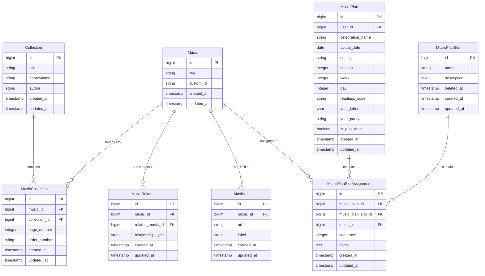

# Music and Collection Design Document

## Overview
This document outlines the design for Music (songs/hymns/pieces) and Collection entities, and their integration with the existing MusicPlan system. Music items can belong to multiple Collections, have related variations, public URLs for scores, and can be assigned to slots within music plans.

## Database Schema

### Table: `musics`
| Column | Type | Description | Constraints |
|--------|------|-------------|-------------|
| `id` | bigint | Primary key | AUTO_INCREMENT |
| `title` | string | Title of the music piece | NOT NULL |
| `custom_id` | string | Custom identifier (e.g., "BWV 132") | NULLABLE |
| `created_at` | timestamp | When the record was created | NULLABLE |
| `updated_at` | timestamp | When the record was last updated | NULLABLE |

**Indexes:**
- Primary key: `id`
- Title index: `title` for searching
- Custom ID index: `custom_id` for lookup

### Table: `collections`
| Column | Type | Description | Constraints |
|--------|------|-------------|-------------|
| `id` | bigint | Primary key | AUTO_INCREMENT |
| `title` | string | Collection title (e.g., "Éneklő Egyház") | NOT NULL |
| `abbreviation` | string | Abbreviation (e.g., "ÉE") | NULLABLE |
| `author` | string | Optional author/editor | NULLABLE |
| `created_at` | timestamp | When the record was created | NULLABLE |
| `updated_at` | timestamp | When the record was last updated | NULLABLE |

**Indexes:**
- Primary key: `id`
- Title index: `title` for searching
- Abbreviation index: `abbreviation` for lookup

### Table: `music_collection` (Pivot)
| Column | Type | Description | Constraints |
|--------|------|-------------|-------------|
| `id` | bigint | Primary key | AUTO_INCREMENT |
| `music_id` | bigint | Foreign key to musics | NOT NULL |
| `collection_id` | bigint | Foreign key to collections | NOT NULL |
| `page_number` | integer | Page number in the collection | NULLABLE |
| `order_number` | string | Order number (e.g., "435b") | NULLABLE |
| `created_at` | timestamp | When the record was created | NULLABLE |
| `updated_at` | timestamp | When the record was last updated | NULLABLE |

**Indexes:**
- Primary key: `id`
- Foreign key indexes: `music_id`, `collection_id`
- Unique constraint: `(music_id, collection_id)` to prevent duplicates
- Collection lookup index: `(collection_id, order_number)` for sorting

**Foreign Keys:**
- `music_collection.music_id` → `musics.id` (cascade on delete)
- `music_collection.collection_id` → `collections.id` (cascade on delete)

### Table: `music_related` (Self-referential for variations)
| Column | Type | Description | Constraints |
|--------|------|-------------|-------------|
| `id` | bigint | Primary key | AUTO_INCREMENT |
| `music_id` | bigint | Foreign key to musics (source) | NOT NULL |
| `related_music_id` | bigint | Foreign key to musics (target) | NOT NULL |
| `relationship_type` | string | Type of relationship (e.g., "variation", "arrangement") | NULLABLE |
| `created_at` | timestamp | When the record was created | NULLABLE |
| `updated_at` | timestamp | When the record was last updated | NULLABLE |

**Indexes:**
- Primary key: `id`
- Foreign key indexes: `music_id`, `related_music_id`
- Unique constraint: `(music_id, related_music_id)` to prevent duplicate relationships
- Reverse lookup index: `(related_music_id, music_id)` for bidirectional queries

**Foreign Keys:**
- `music_related.music_id` → `musics.id` (cascade on delete)
- `music_related.related_music_id` → `musics.id` (cascade on delete)

### Table: `music_urls`
| Column | Type | Description | Constraints |
|--------|------|-------------|-------------|
| `id` | bigint | Primary key | AUTO_INCREMENT |
| `music_id` | bigint | Foreign key to musics | NOT NULL |
| `url` | string | Public URL for score/download | NOT NULL |
| `label` | string | Label (e.g., "Score PDF", "Audio", "YouTube") | NULLABLE |
| `created_at` | timestamp | When the record was created | NULLABLE |
| `updated_at` | timestamp | When the record was last updated | NULLABLE |

**Indexes:**
- Primary key: `id`
- Foreign key index: `music_id`
- URL index: `url` for deduplication

**Foreign Keys:**
- `music_urls.music_id` → `musics.id` (cascade on delete)

### Table: `music_plan_slot_assignments`
| Column | Type | Description | Constraints |
|--------|------|-------------|-------------|
| `id` | bigint | Primary key | AUTO_INCREMENT |
| `music_plan_id` | bigint | Foreign key to music_plans | NOT NULL |
| `music_plan_slot_id` | bigint | Foreign key to music_plan_slots | NOT NULL |
| `music_id` | bigint | Foreign key to musics | NOT NULL |
| `sequence` | integer | Order within the slot | DEFAULT 1 |
| `notes` | text | Optional notes about this assignment | NULLABLE |
| `created_at` | timestamp | When the record was created | NULLABLE |
| `updated_at` | timestamp | When the record was last updated | NULLABLE |

**Indexes:**
- Primary key: `id`
- Foreign key indexes: `music_plan_id`, `music_plan_slot_id`, `music_id`
- Unique constraint: `(music_plan_id, music_plan_slot_id, music_id)` to prevent duplicate assignments
- Slot ordering index: `(music_plan_id, music_plan_slot_id, sequence)` for ordering within slot

**Foreign Keys:**
- `music_plan_slot_assignments.music_plan_id` → `music_plans.id` (cascade on delete)
- `music_plan_slot_assignments.music_plan_slot_id` → `music_plan_slots.id` (cascade on delete)
- `music_plan_slot_assignments.music_id` → `musics.id` (cascade on delete)

## Entity Relationship Diagram



## Eloquent Model Design

### Model: `Music`
Located at `app/Models/Music.php`

```php
<?php

namespace App\Models;

use Illuminate\Database\Eloquent\Factories\HasFactory;
use Illuminate\Database\Eloquent\Model;
use Illuminate\Database\Eloquent\Relations\BelongsToMany;
use Illuminate\Database\Eloquent\Relations\HasMany;

class Music extends Model
{
    use HasFactory;

    /**
     * The attributes that are mass assignable.
     *
     * @var list<string>
     */
    protected $fillable = [
        'title',
        'custom_id',
    ];

    /**
     * Get the collections that include this music.
     */
    public function collections(): BelongsToMany
    {
        return $this->belongsToMany(Collection::class, 'music_collection')
            ->withPivot(['page_number', 'order_number'])
            ->withTimestamps();
    }

    /**
     * Get the related music items (variations).
     */
    public function relatedMusic(): BelongsToMany
    {
        return $this->belongsToMany(Music::class, 'music_related', 'music_id', 'related_music_id')
            ->withPivot('relationship_type')
            ->withTimestamps();
    }

    /**
     * Get the public URLs for this music.
     */
    public function urls(): HasMany
    {
        return $this->hasMany(MusicUrl::class);
    }

    /**
     * Get the music plan slot assignments for this music.
     */
    public function musicPlanSlotAssignments(): HasMany
    {
        return $this->hasMany(MusicPlanSlotAssignment::class);
    }

    /**
     * Scope for searching by title or custom ID.
     */
    public function scopeSearch($query, string $search): void
    {
        $query->where('title', 'like', "%{$search}%")
            ->orWhere('custom_id', 'like', "%{$search}%");
    }
}
```

### Model: `Collection`
Located at `app/Models/Collection.php`

```php
<?php

namespace App\Models;

use Illuminate\Database\Eloquent\Factories\HasFactory;
use Illuminate\Database\Eloquent\Model;
use Illuminate\Database\Eloquent\Relations\BelongsToMany;

class Collection extends Model
{
    use HasFactory;

    /**
     * The attributes that are mass assignable.
     *
     * @var list<string>
     */
    protected $fillable = [
        'title',
        'abbreviation',
        'author',
    ];

    /**
     * Get the music items in this collection.
     */
    public function music(): BelongsToMany
    {
        return $this->belongsToMany(Music::class, 'music_collection')
            ->withPivot(['page_number', 'order_number'])
            ->withTimestamps()
            ->orderByPivot('order_number');
    }

    /**
     * Scope for searching by title or abbreviation.
     */
    public function scopeSearch($query, string $search): void
    {
        $query->where('title', 'like', "%{$search}%")
            ->orWhere('abbreviation', 'like', "%{$search}%")
            ->orWhere('author', 'like', "%{$search}%");
    }
}
```

### Model: `MusicUrl`
Located at `app/Models/MusicUrl.php`

```php
<?php

namespace App\Models;

use Illuminate\Database\Eloquent\Factories\HasFactory;
use Illuminate\Database\Eloquent\Model;
use Illuminate\Database\Eloquent\Relations\BelongsTo;

class MusicUrl extends Model
{
    use HasFactory;

    /**
     * The attributes that are mass assignable.
     *
     * @var list<string>
     */
    protected $fillable = [
        'music_id',
        'url',
        'label',
    ];

    /**
     * Get the music that owns this URL.
     */
    public function music(): BelongsTo
    {
        return $this->belongsTo(Music::class);
    }
}
```

### Model: `MusicPlanSlotAssignment`
Located at `app/Models/MusicPlanSlotAssignment.php`

```php
<?php

namespace App\Models;

use Illuminate\Database\Eloquent\Factories\HasFactory;
use Illuminate\Database\Eloquent\Model;
use Illuminate\Database\Eloquent\Relations\BelongsTo;

class MusicPlanSlotAssignment extends Model
{
    use HasFactory;

    /**
     * The attributes that are mass assignable.
     *
     * @var list<string>
     */
    protected $fillable = [
        'music_plan_id',
        'music_plan_slot_id',
        'music_id',
        'sequence',
        'notes',
    ];

    /**
     * Get the music plan that owns this assignment.
     */
    public function musicPlan(): BelongsTo
    {
        return $this->belongsTo(MusicPlan::class);
    }

    /**
     * Get the music plan slot that owns this assignment.
     */
    public function musicPlanSlot(): BelongsTo
    {
        return $this->belongsTo(MusicPlanSlot::class);
    }

    /**
     * Get the music that is assigned.
     */
    public function music(): BelongsTo
    {
        return $this->belongsTo(Music::class);
    }

    /**
     * Scope for assignments in a specific music plan.
     */
    public function scopeForMusicPlan($query, MusicPlan $musicPlan): void
    {
        $query->where('music_plan_id', $musicPlan->id);
    }

    /**
     * Scope for assignments in a specific slot.
     */
    public function scopeForSlot($query, MusicPlanSlot $slot): void
    {
        $query->where('music_plan_slot_id', $slot->id);
    }
}
```

### Updated Model: `MusicPlan`
Add relationship to `MusicPlanSlotAssignment`:

```php
// In app/Models/MusicPlan.php
/**
 * Get the music assignments for this plan.
 */
public function musicAssignments(): HasMany
{
    return $this->hasMany(MusicPlanSlotAssignment::class);
}

/**
 * Get the music items assigned to this plan (through assignments).
 */
public function assignedMusic(): BelongsToMany
{
    return $this->belongsToMany(Music::class, 'music_plan_slot_assignments')
        ->withPivot(['music_plan_slot_id', 'sequence', 'notes'])
        ->withTimestamps();
}
```

### Updated Model: `MusicPlanSlot`
Add relationship to `MusicPlanSlotAssignment`:

```php
// In app/Models/MusicPlanSlot.php
/**
 * Get the music assignments for this slot.
 */
public function musicAssignments(): HasMany
{
    return $this->hasMany(MusicPlanSlotAssignment::class);
}

/**
 * Get the music items assigned to this slot (through assignments).
 */
public function assignedMusic(): BelongsToMany
{
    return $this->belongsToMany(Music::class, 'music_plan_slot_assignments')
        ->withPivot(['music_plan_id', 'sequence', 'notes'])
        ->withTimestamps();
}
```

## Migration Files

### 1. Create Musics Table
```php
<?php

use Illuminate\Database\Migrations\Migration;
use Illuminate\Database\Schema\Blueprint;
use Illuminate\Support\Facades\Schema;

return new class extends Migration
{
    public function up(): void
    {
        Schema::create('musics', function (Blueprint $table) {
            $table->id();
            $table->string('title');
            $table->string('custom_id')->nullable();
            $table->timestamps();
            
            $table->index('title');
            $table->index('custom_id');
        });
    }

    public function down(): void
    {
        Schema::dropIfExists('musics');
    }
};
```

### 2. Create Collections Table
```php
<?php

use Illuminate\Database\Migrations\Migration;
use Illuminate\Database\Schema\Blueprint;
use Illuminate\Support\Facades\Schema;

return new class extends Migration
{
    public function up(): void
    {
        Schema::create('collections', function (Blueprint $table) {
            $table->id();
            $table->string('title');
            $table->string('abbreviation')->nullable();
            $table->string('author')->nullable();
            $table->timestamps();
            
            $table->index('title');
            $table->index('abbreviation');
        });
    }

    public function down(): void
    {
        Schema::dropIfExists('collections');
    }
};
```

### 3. Create Music Collection Pivot Table
```php
<?php

use Illuminate\Database\Migrations\Migration;
use Illuminate\Database\Schema\Blueprint;
use Illuminate\Support\Facades\Schema;

return new class extends Migration
{
    public function up(): void
    {
        Schema::create('music_collection', function (Blueprint $table) {
            $table->id();
            $table->foreignId('music_id')->constrained()->cascadeOnDelete();
            $table->foreignId('collection_id')->constrained()->cascadeOnDelete();
            $table->integer('page_number')->nullable();
            $table->string('order_number')->nullable();
            $table->timestamps();
            
            $table->unique(['music_id', 'collection_id']);
            $table->index(['collection_id', 'order_number']);
        });
    }

    public function down(): void
    {
        Schema::dropIfExists('music_collection');
    }
};
```

### 4. Create Music Related Pivot Table
```php
<?php

use Illuminate\Database\Migrations\Migration;
use Illuminate\Database\Schema\Blueprint;
use Illuminate\Support\Facades\Schema;

return new class extends Migration
{
    public function up(): void
    {
        Schema::create('music_related', function (Blueprint $table) {
            $table->id();
            $table->foreignId('music_id')->constrained('musics')->cascadeOnDelete();
            $table->foreignId('related_music_id')->constrained('musics')->cascadeOnDelete();
            $table->string('relationship_type')->nullable();
            $table->timestamps();
            
            $table->unique(['music_id', 'related_music_id']);
            $table->index(['related_music_id', 'music_id']);
        });
    }

    public function down(): void
    {
        Schema::dropIfExists('music_related');
    }
};
```

### 5. Create Music URLs Table
```php
<?php

use Illuminate\Database\Migrations\Migration;
use Illuminate\Database\Schema\Blueprint;
use Illuminate\Support\Facades\Schema;

return new class extends Migration
{
    public function up(): void
    {
        Schema::create('music_urls', function (Blueprint $table) {
            $table->id();
            $table->foreignId('music_id')->constrained()->cascadeOnDelete();
            $table->string('url');
            $table->string('label')->nullable();
            $table->timestamps();
            
            $table->index('url');
        });
    }

    public function down(): void
    {
        Schema::dropIfExists('music_urls');
    }
};
```

### 6. Create Music Plan Slot Assignments Table
```php
<?php

use Illuminate\Database\Migrations\Migration;
use Illuminate\Database\Schema\Blueprint;
use Illuminate\Support\Facades\Schema;

return new class extends Migration
{
    public function up(): void
    {
        Schema::create('music_plan_slot_assignments', function (Blueprint $table) {
            $table->id();
            $table->foreignId('music_plan_id')->constrained()->cascadeOnDelete();
            $table->foreignId('music_plan_slot_id')->constrained()->cascadeOnDelete();
            $table->foreignId('music_id')->constrained()->cascadeOnDelete();
            $table->integer('sequence')->default(1);
            $table->text('notes')->nullable();
            $table->timestamps();
            
            $table->unique(['music_plan_id', 'music_plan_slot_id', 'music_id']);
            $table->index(['music_plan_id', 'music_plan_slot_id', 'sequence']);
        });
    }

    public function down(): void
    {
        Schema::dropIfExists('music_plan_slot_assignments');
    }
};
```

## Factory and Seeder Design

### MusicFactory
```php
<?php

namespace Database\Factories;

use Illuminate\Database\Eloquent\Factories\Factory;

class MusicFactory extends Factory
{
    public function definition(): array
    {
        return [
            'title' => $this->faker->words(3, true),
            'custom_id' => $this->faker->optional()->regexify('[A-Z]{3} \d{3}[a-z]?'),
        ];
    }
}
```

### CollectionFactory
```php
<?php

namespace Database\Factories;

use Illuminate\Database\Eloquent\Factories\Factory;

class CollectionFactory extends Factory
{
    public function definition(): array
    {
        return [
            'title' => $this->faker->words(4, true),
            'abbreviation' => $this->faker->optional()->regexify('[A-Z]{2,4}'),
            'author' => $this->faker->optional()->name(),
        ];
    }
}
```

### DatabaseSeeder updates
Add seeding for music and collections with relationships.

## Auditing Requirements

To track changes made by users to Music, Collections, and their relationships, we will implement auditing using the `owen-it/laravel-auditing` package.

### Models to Audit
1. **Music** - track creation, updates, and deletions
2. **Collection** - track creation, updates, and deletions
3. **MusicUrl** - track URL additions, updates, and removals
4. **Pivot relationships** (optional consideration):
   - `music_collection` (music-collection membership with page/order)
   - `music_related` (music-music relationships)
   - These could be audited via the parent models or separately

### Implementation Plan

#### 1. Package Installation
```bash
composer require owen-it/laravel-auditing
```

#### 2. Publish Configuration
```bash
php artisan vendor:publish --provider="OwenIt\Auditing\AuditingServiceProvider"
```

#### 3. Update Models to Implement Auditable

**Music Model:**
```php
<?php

namespace App\Models;

use Illuminate\Database\Eloquent\Factories\HasFactory;
use Illuminate\Database\Eloquent\Model;
use Illuminate\Database\Eloquent\Relations\BelongsToMany;
use Illuminate\Database\Eloquent\Relations\HasMany;
use OwenIt\Auditing\Auditable;
use OwenIt\Auditing\Contracts\Auditable as AuditableContract;

class Music extends Model implements AuditableContract
{
    use HasFactory, Auditable;

    // ... existing code ...
}
```

**Collection Model:**
```php
<?php

namespace App\Models;

use Illuminate\Database\Eloquent\Factories\HasFactory;
use Illuminate\Database\Eloquent\Model;
use Illuminate\Database\Eloquent\Relations\BelongsToMany;
use OwenIt\Auditing\Auditable;
use OwenIt\Auditing\Contracts\Auditable as AuditableContract;

class Collection extends Model implements AuditableContract
{
    use HasFactory, Auditable;

    // ... existing code ...
}
```

**MusicUrl Model:**
```php
<?php

namespace App\Models;

use Illuminate\Database\Eloquent\Factories\HasFactory;
use Illuminate\Database\Eloquent\Model;
use Illuminate\Database\Eloquent\Relations\BelongsTo;
use OwenIt\Auditing\Auditable;
use OwenIt\Auditing\Contracts\Auditable as AuditableContract;

class MusicUrl extends Model implements AuditableContract
{
    use HasFactory, Auditable;

    // ... existing code ...
}
```

#### 4. Audit Configuration
Configure `config/audit.php` to include:
- Track user ID (default)
- Include all attributes for auditing
- Exclude timestamps if desired

#### 5. Relationship Auditing Considerations
For pivot tables (`music_collection`, `music_related`), we have options:
- Audit via parent model events (when music is attached/detached from collection)
- Create custom events to log relationship changes
- Use package's relationship auditing features if supported

Simpler approach: Since these are pivot tables with additional data (page_number, order_number, relationship_type), we should audit them as separate models or via the parent model's `updated` event when relationships change.

### Audit Log Access
- Provide admin interface to view audit logs
- Show who changed what and when
- Allow filtering by model, user, date range

## Integration with Existing System

### User Permissions
- All users can add new Music (as per requirement "All users will be able to add new Music")
- Collections may be managed by admins or all users (TBD)
- MusicPlanSlotAssignment creation/modification follows MusicPlan ownership rules
- All changes are audited regardless of user role

### UI Considerations
1. Music search/select component for assigning to slots
2. Collection management interface
3. Music creation form (title, custom ID, URLs, related music)
4. Slot assignment interface within MusicPlan editor
5. Audit log viewer for administrators

## Next Steps
1. Install and configure `owen-it/laravel-auditing` package
2. Implement migrations for Music, Collection, and related tables
3. Create models with relationships and Auditable implementation
4. Create factories and seeders
5. Update MusicPlan editor to support music assignments
6. Create admin interfaces for Music and Collection management
7. Implement audit log viewer
8. Write tests for new functionality including auditing

## Resolved Design Decisions

### 1. Collection Ownership
- **Collections are global/shared** - No `user_id` field needed
- Purpose of the site is to share music plans; community maintains collections
- Auditing provides accountability for spam/trolling collections

### 2. Music Additional Fields
- Additional fields (composer, duration, key, etc.) will be added later as needed
- Current design includes only essential fields: `title` and `custom_id`

### 3. Soft Deletes
- **No soft deletes** for Music and Collection models
- Hard deletes only; auditing tracks all deletions
- Simpler implementation for initial version

### 4. Duplicate Music Entries
- **No deduplication logic** for now
- Most duplicates will be unintentional (typos in titles)
- Future feature: easy search to find existing music before creating new entries

### 5. Pivot Table Auditing
- **No separate models for pivot table auditing**
- Changes to relationships will be tracked via parent model updates
- Simpler auditing implementation; can be enhanced later if needed

### 6. User Permissions for Collections
- Collections can be managed by all users (community-maintained)
- Admin oversight via audit logs to prevent abuse
