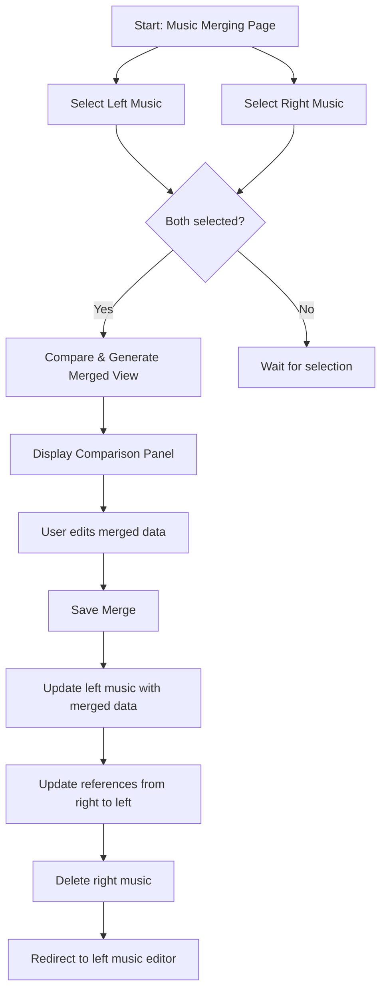

# Music Merging Component Architecture

## Overview
A page for merging two music records with a three-panel sidebar layout:
1. **Left Panel**: Select first music (source A)
2. **Right Panel**: Select second music (source B)
3. **Comparison Panel**: Shows merged attributes with conflict detection, editable fields, and merge actions

## Workflow

## Data Model Considerations

### Music Attributes to Merge
- **Direct fields**: `title`, `subtitle`, `custom_id`, `is_private`, `user_id`
- **Relationships**:
  - `collections` (many-to-many with pivot: `page_number`, `order_number`)
  - `genres` (many-to-many)
  - `urls` (one-to-many)
  - `relatedMusic` (self-referential many-to-many)
  - `musicPlanSlotAssignments` (one-to-many)

### Conflict Resolution Rules
1. **Direct fields**: If values differ, use left as default, mark as conflict
2. **Collections**:
   - Same collection but different page/order → conflict (use left's pivot)
   - Different collections → include both
3. **Genres**: Union of both sets (no conflict)
4. **URLs**: Union of both sets (no conflict)
5. **Related music**: Union of both sets (no conflict)
6. **Music plan slot assignments**: Update references from right to left during merge

## Component Structure

### Livewire Component: `MusicMerger`
- **Location**: `app/Livewire/Pages/Editor/MusicMerger.php`
- **Properties**:
  - `$leftMusicId`, `$rightMusicId` (selected music IDs)
  - `$leftMusic`, `$rightMusic` (loaded models)
  - `$mergedData` (array of merged attributes)
  - `$conflicts` (list of fields with conflicts)
  - `$showComparison` (boolean)
- **Methods**:
  - `compare()`: Load both music, compute merged data
  - `saveMerge()`: Update left music, transfer relationships, delete right
  - `updateMergedField()`: Handle user edits

### Views
- **Main view**: `resources/views/pages/editor/music-merger.blade.php`
- **Layout**: Uses app layout with sidebar
- **Three-column responsive design** using Tailwind grid

## Implementation Steps

1. **Create Livewire component** with multi-file structure
2. **Implement music selection** with searchable dropdowns
3. **Build comparison logic** for each attribute type
4. **Design UI** for conflict visualization (badges, colors)
5. **Implement merge save** with transaction
6. **Add validation** and confirmation
7. **Write tests** for merge scenarios

## Edge Cases
- One music is private, other public → merged privacy?
- User permissions (must own both or have editor role)
- Circular references in related music
- Audit logging for merge operation

## Success Criteria
- Left music updated with combined data
- All references to right music updated to left
- Right music deleted
- User redirected to updated left music editor
- Audit trail of merge operation