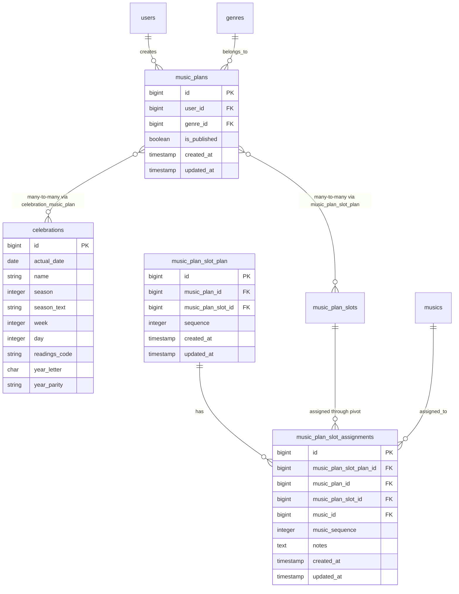

# MusicPlan Design Document

## Overview
MusicPlan represents a personal plan for a Catholic Mass. It is connected to a user and contains liturgical information through its relationship with Celebrations. The plan consists of slots (liturgical elements) that can have multiple music assignments.

## Database Schema

### Table: `music_plans`
| Column | Type | Description | Constraints |
|--------|------|-------------|-------------|
| `id` | bigint | Primary key | AUTO_INCREMENT |
| `user_id` | bigint | Foreign key to users table | NOT NULL, INDEX |
| `genre_id` | bigint | Foreign key to genres table | NULLABLE |
| `is_published` | boolean | Whether the plan is published or private | DEFAULT false |
| `created_at` | timestamp | When the record was created | NULLABLE |
| `updated_at` | timestamp | When the record was last updated | NULLABLE |

**Indexes:**
1. Primary key: `id`
2. Foreign key index: `user_id` (references `users.id`)
3. User visibility index: `(user_id, is_published)` for user-specific queries
4. Genre index: `genre_id` (references `genres.id`)

**Foreign Keys:**
- `music_plans.user_id` → `users.id` (cascade on delete)
- `music_plans.genre_id` → `genres.id` (set null on delete)

### Table: `music_plan_slot_plan` (Pivot table)
| Column | Type | Description | Constraints |
|--------|------|-------------|-------------|
| `id` | bigint | Primary key | AUTO_INCREMENT |
| `music_plan_id` | bigint | Foreign key to music_plans | NOT NULL |
| `music_plan_slot_id` | bigint | Foreign key to music_plan_slots | NOT NULL |
| `sequence` | integer | Order of the slot within the music plan | NOT NULL, DEFAULT 1 |
| `created_at` | timestamp | When the record was created | NULLABLE |
| `updated_at` | timestamp | When the record was last updated | NULLABLE |

**Indexes:**
1. Primary key: `id`
2. Foreign key indexes: `music_plan_id`, `music_plan_slot_id`

**Foreign Keys:**
- `music_plan_slot_plan.music_plan_id` → `music_plans.id` (cascade on delete)
- `music_plan_slot_plan.music_plan_slot_id` → `music_plan_slots.id` (restrict on delete)

### Table: `music_plan_slot_assignments`
| Column | Type | Description | Constraints |
|--------|------|-------------|-------------|
| `id` | bigint | Primary key | AUTO_INCREMENT |
| `music_plan_slot_plan_id` | bigint | Foreign key to music_plan_slot_plan pivot | NOT NULL |
| `music_plan_id` | bigint | Foreign key to music_plans (redundant for compatibility) | NOT NULL |
| `music_plan_slot_id` | bigint | Foreign key to music_plan_slots (redundant for compatibility) | NOT NULL |
| `music_id` | bigint | Foreign key to musics table | NOT NULL |
| `music_sequence` | integer | Order of music within the slot instance | NOT NULL, DEFAULT 1 |
| `notes` | text | Optional notes about the assignment | NULLABLE |
| `created_at` | timestamp | When the record was created | NULLABLE |
| `updated_at` | timestamp | When the record was last updated | NULLABLE |

**Indexes:**
1. Primary key: `id`
2. Foreign key indexes: `music_plan_slot_plan_id`, `music_plan_id`, `music_plan_slot_id`, `music_id`
3. Pivot sequence index: `(music_plan_slot_plan_id, music_sequence)` for ordering within slot instance
4. Plan-slot-music index: `(music_plan_id, music_plan_slot_id, music_id)` for quick lookups

**Foreign Keys:**
- `music_plan_slot_assignments.music_plan_slot_plan_id` → `music_plan_slot_plan.id` (cascade on delete)
- `music_plan_slot_assignments.music_plan_id` → `music_plans.id` (cascade on delete)
- `music_plan_slot_assignments.music_plan_slot_id` → `music_plan_slots.id` (restrict on delete)
- `music_plan_slot_assignments.music_id` → `musics.id` (cascade on delete)

### Table: `celebration_music_plan` (Pivot table for Celebrations)
| Column | Type | Description | Constraints |
|--------|------|-------------|-------------|
| `id` | bigint | Primary key | AUTO_INCREMENT |
| `celebration_id` | bigint | Foreign key to celebrations table | NOT NULL |
| `music_plan_id` | bigint | Foreign key to music_plans table | NOT NULL |
| `created_at` | timestamp | When the record was created | NULLABLE |
| `updated_at` | timestamp | When the record was last updated | NULLABLE |

**Indexes:**
1. Primary key: `id`
2. Unique constraint: `(celebration_id, music_plan_id)` prevents duplicate associations
3. Foreign key indexes: `celebration_id`, `music_plan_id`

**Foreign Keys:**
- `celebration_music_plan.celebration_id` → `celebrations.id` (cascade on delete)
- `celebration_music_plan.music_plan_id` → `music_plans.id` (cascade on delete)

## Relationships Diagram



## Eloquent Model Design

### Model: `MusicPlan`
Located at `app/Models/MusicPlan.php`

```php
<?php

namespace App\Models;

use Illuminate\Database\Eloquent\Model;
use Illuminate\Database\Eloquent\Relations\BelongsTo;
use Illuminate\Database\Eloquent\Relations\BelongsToMany;
use Illuminate\Database\Eloquent\Relations\HasMany;

class MusicPlan extends Model
{
    /**
     * The attributes that are mass assignable.
     *
     * @var list<string>
     */
    protected $fillable = [
        'user_id',
        'genre_id',
        'is_published',
    ];

    /**
     * Get the attributes that should be cast.
     *
     * @return array<string, string>
     */
    protected function casts(): array
    {
        return [
            'is_published' => 'boolean',
        ];
    }

    /**
     * Get the user that owns the music plan.
     */
    public function user(): BelongsTo
    {
        return $this->belongsTo(User::class);
    }

    /**
     * Get the genre associated with this music plan.
     */
    public function genre(): BelongsTo
    {
        return $this->belongsTo(Genre::class);
    }

    /**
     * Get the celebrations for this music plan.
     */
    public function celebrations(): BelongsToMany
    {
        return $this->belongsToMany(Celebration::class, 'celebration_music_plan')
            ->withTimestamps();
    }

    /**
     * Get the slots for this music plan.
     */
    public function slots(): BelongsToMany
    {
        return $this->belongsToMany(MusicPlanSlot::class, 'music_plan_slot_plan')
            ->withPivot('sequence')
            ->orderByPivot('sequence');
    }

    /**
     * Get the music assignments for this plan.
     */
    public function musicAssignments(): HasMany
    {
        return $this->hasMany(MusicPlanSlotAssignment::class);
    }

    /**
     * Get the music items assigned to this plan (through assignments).
     * This is a convenience method that goes through the MusicPlanSlotAssignment model.
     */
    public function assignedMusic(): \Illuminate\Database\Eloquent\Relations\HasManyThrough
    {
        return $this->hasManyThrough(
            Music::class,
            MusicPlanSlotAssignment::class,
            'music_plan_id', // Foreign key on MusicPlanSlotAssignment table
            'id', // Foreign key on Music table
            'id', // Local key on MusicPlan table
            'music_id' // Foreign key on MusicPlanSlotAssignment table
        );
    }

    /**
     * Scope for published plans.
     */
    public function scopePublished($query)
    {
        return $query->where('is_published', true);
    }

    /**
     * Scope for private plans.
     */
    public function scopePrivate($query)
    {
        return $query->where('is_published', false);
    }

    /**
     * Scope for plans by genre.
     */
    public function scopeByGenre($query, $genre)
    {
        if ($genre instanceof Genre) {
            return $query->where('genre_id', $genre->id);
        }

        return $query->where('genre_id', $genre);
    }

    /**
     * Scope for plans belonging to the current user's genre.
     */
    public function scopeForCurrentGenre($query)
    {
        $user = Auth::user();
        if (! $user) {
            // No authenticated user, return empty
            return $query->whereRaw('1 = 0');
        }

        $genreId = $user->current_genre_id;
        if ($genreId) {
            return $query->where('genre_id', $genreId);
        }

        // If no genre ID, show all music plans (no filtering)
        return $query;
    }

    /**
     * Get the genre options for select inputs.
     */
    public static function genreOptions(): array
    {
        return Genre::options();
    }

    /**
     * Get the first celebration's day name for the liturgical day number.
     * This is a convenience method to access day name from the first associated celebration.
     */
    public function getDayNameAttribute(): string
    {
        $firstCelebration = $this->celebrations->first();
        if ($firstCelebration) {
            return $firstCelebration->day_name;
        }

        return 'ismeretlen';
    }

    /**
     * Get the first celebration's name.
     * This is a convenience method to access celebration name from the first associated celebration.
     */
    public function getCelebrationNameAttribute(): ?string
    {
        $firstCelebration = $this->celebrations->first();

        return $firstCelebration?->name;
    }

    /**
     * Get the first celebration's actual date.
     * This is a convenience method to access actual date from the first associated celebration.
     */
    public function getActualDateAttribute(): ?\Illuminate\Support\Carbon
    {
        $firstCelebration = $this->celebrations->first();

        $date = $firstCelebration?->actual_date;
        if ($date === null) {
            return null;
        }

        return \Illuminate\Support\Carbon::parse($date);
    }

    /**
     * Get the setting name from genre (backward compatibility).
     */
    public function getSettingAttribute(): ?string
    {
        return $this->genre?->name;
    }

    /**
     * Detach a slot from this music plan and delete all music assignments for that slot.
     */
    public function detachSlot(MusicPlanSlot|int $slot): void
    {
        $slotId = $slot instanceof MusicPlanSlot ? $slot->id : $slot;

        // Delete all music assignments for this slot in this plan
        $this->musicAssignments()
            ->where('music_plan_slot_id', $slotId)
            ->delete();

        // Detach the slot from the plan
        $this->slots()->detach($slotId);
    }

    /**
     * Detach all slots from this music plan and delete all music assignments.
     */
    public function detachAllSlots(): void
    {
        // Delete all music assignments for this plan
        $this->musicAssignments()->delete();

        // Detach all slots from the plan
        $this->slots()->detach();
    }
}
```

### Model: `MusicPlanSlotAssignment`
Located at `app/Models/MusicPlanSlotAssignment.php`

```php
<?php

namespace App\Models;

use Illuminate\Database\Eloquent\Factories\HasFactory;
use Illuminate\Database\Eloquent\Model;
use Illuminate\Database\Eloquent\Relations\BelongsTo;

/**
 * Class MusicPlanSlotAssignment
 *
 * Represents an assignment of a music track to a specific slot within a music plan.
 */
class MusicPlanSlotAssignment extends Model
{
    use HasFactory;

    /**
     * The attributes that are mass assignable.
     * IMPORTANT: music_plan_slot_plan_id identifies the specific slot instance within the music plan,
     * while music_sequence is identifying the position of the music within the slot.
     * This allows for multiple tracks to be assigned to the same slot in a specific order.
     * The music_plan_id and music_plan_slot_id are kept for compatibility and referential integrity.
     *
     * @var list<string>
     */
    protected $fillable = [
        'music_plan_slot_plan_id',
        'music_plan_id',
        'music_plan_slot_id',
        'music_id',
        'music_sequence',
        'notes',
    ];

    /**
     * Get the music plan that owns this assignment.
     */
    public function musicPlan(): BelongsTo
    {
        return $this->belongsTo(MusicPlan::class);
    }

    /**
     * Get the music plan slot that owns this assignment.
     */
    public function musicPlanSlot(): BelongsTo
    {
        return $this->belongsTo(MusicPlanSlot::class);
    }

    /**
     * Get the music plan slot plan (pivot) that owns this assignment.
     */
    public function musicPlanSlotPlan(): BelongsTo
    {
        return $this->belongsTo(MusicPlanSlotPlan::class);
    }

    /**
     * Get the music that is assigned.
     */
    public function music(): BelongsTo
    {
        return $this->belongsTo(Music::class);
    }

    /**
     * Scope for assignments in a specific music plan.
     */
    public function scopeForMusicPlan($query, MusicPlan $musicPlan): void
    {
        $query->where('music_plan_id', $musicPlan->id);
    }

    /**
     * Scope for assignments in a specific slot.
     */
    public function scopeForSlot($query, MusicPlanSlot $slot): void
    {
        $query->where('music_plan_slot_id', $slot->id);
    }
}
```

### Model: `MusicPlanSlotPlan`
Located at `app/Models/MusicPlanSlotPlan.php`

```php
<?php

namespace App\Models;

use Illuminate\Database\Eloquent\Model;
use Illuminate\Database\Eloquent\Relations\BelongsTo;
use Illuminate\Database\Eloquent\Relations\HasMany;

class MusicPlanSlotPlan extends Model
{
    /**
     * The attributes that are mass assignable.
     *
     * @var list<string>
     */
    protected $fillable = [
        'music_plan_id',
        'music_plan_slot_id',
        'sequence',
    ];

    /**
     * Get the music plan that owns this pivot.
     */
    public function musicPlan(): BelongsTo
    {
        return $this->belongsTo(MusicPlan::class);
    }

    /**
     * Get the music plan slot that owns this pivot.
     */
    public function musicPlanSlot(): BelongsTo
    {
        return $this->belongsTo(MusicPlanSlot::class);
    }

    /**
     * Get the music assignments for this pivot.
     */
    public function musicAssignments(): HasMany
    {
        return $this->hasMany(MusicPlanSlotAssignment::class);
    }
}
```

## Key Design Concepts

### 1. Slot Instance Management
- Each slot in a music plan is represented by a row in `music_plan_slot_plan` (pivot table)
- The same slot type (e.g., "Gloria") can appear multiple times in a plan with different `sequence` values
- Each slot instance can have multiple music assignments

### 2. Music Assignment System
- Music assignments are linked to specific slot instances via `music_plan_slot_plan_id`
- Multiple music tracks can be assigned to a single slot instance with ordering via `music_sequence`
- Assignments cascade delete when the slot instance is removed from the plan

### 3. Liturgical Information
- Music plans are associated with Celebrations through the `celebration_music_plan` pivot table
- A music plan can have multiple celebrations (e.g., multiple Masses on the same day)
- Celebration data provides liturgical context: date, season, week, day, readings, etc.

### 4. Genre-Based Organization
- Music plans belong to a Genre (replaces the old "setting" concept)
- Users can filter and organize plans by genre
- Genres represent different musical settings or communities

## Usage Examples

### Creating a Music Plan with Slots and Assignments
```php
// Create a music plan
$musicPlan = MusicPlan::create([
    'user_id' => Auth::id(),
    'genre_id' => $genre->id,
    'is_published' => false,
]);

// Associate with a celebration
$musicPlan->celebrations()->attach($celebration->id);

// Add slots to the plan
$musicPlan->slots()->attach($slot1->id, ['sequence' => 1]);
$musicPlan->slots()->attach($slot2->id, ['sequence' => 2]);

// Get the pivot row for a specific slot instance
$pivot = $musicPlan->slots()->where('music_plan_slot_id', $slot1->id)
    ->wherePivot('sequence', 1)
    ->first()
    ->pivot;

// Assign music to the slot instance
MusicPlanSlotAssignment::create([
    'music_plan_slot_plan_id' => $pivot->id,
    'music_plan_id' => $musicPlan->id,
    'music_plan_slot_id' => $slot1->id,
    'music_id' => $music->id,
    'music_sequence' => 1,
]);
```

### Retrieving a Music Plan with All Relationships
```php
$musicPlan = MusicPlan::with([
    'celebrations',
    'slots',
    'slots.musicAssignments.music',
    'genre',
    'user'
])->find($id);

// Access liturgical information
$date = $musicPlan->actual_date; // From first celebration
$dayName = $musicPlan->day_name; // From first celebration
$celebrationName = $musicPlan->celebration_name; // From first celebration

// Iterate through slots with their assignments
foreach ($musicPlan->slots as $slot) {
    echo "Slot: {$slot->name} (Sequence: {$slot->pivot->sequence})\n";
    
    // Get assignments for this specific slot instance
    $assignments = $slot->musicAssignments()
        ->where('music_plan_slot_plan_id', $slot->pivot->id)
        ->orderBy('music_sequence')
        ->with('music')
        ->get();
        
    foreach ($assignments as $assignment) {
        echo "  - Music: {$assignment->music->title} (Sequence: {$assignment->music_sequence})\n";
    }
}
```

## Testing Considerations

Tests should verify:
1. Slot instances maintain correct sequence when reordering
2. Music assignments are properly ordered within slot instances
3. Deleting a slot instance cascades to its music assignments
4. Deleting a music plan cascades to all related data
5. Celebrations can be associated/disassociated correctly
6. Genre-based filtering works as expected

See `tests/Feature/MusicPlanSlotSequenceTest.php` and `tests/Feature/MusicPlanSlotAssignmentDeletionTest.php` for examples.