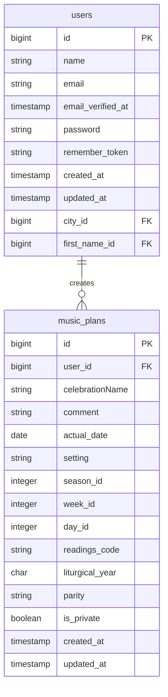
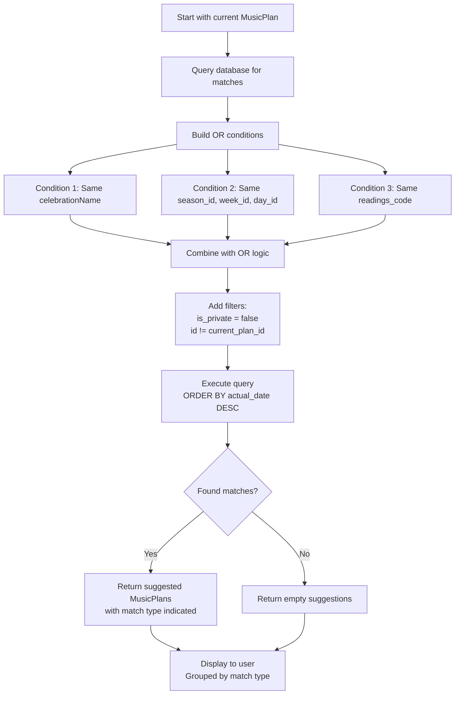
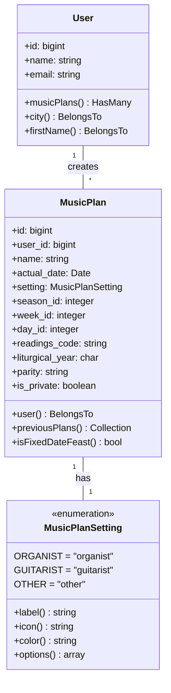

# MusicPlan System Architecture

## Entity Relationship Diagram



## Lookup Workflow



**Lookup Logic Details:**
- **Match Type 1 (Celebration)**: `celebrationName = ?`
- **Match Type 2 (Liturgical)**: `season_id = ? AND week_id = ? AND day_id = ?` (liturgical_year NOT considered)
- **Match Type 3 (Readings)**: `readings_code = ?`
- **Filters Applied**: `is_private = false`, `id != current_plan_id`
- **Ordering**: `actual_date DESC` (most recent first)
- **Scope**: All published plans regardless of user

## Model Relationships



## Database Index Strategy

| Index | Columns | Purpose | Query Example |
|-------|---------|---------|---------------|
| Primary | `id` | Unique identification | `WHERE id = ?` |
| User Visibility | `user_id, is_private` | User-specific queries | `WHERE user_id = ? AND is_private = ?` |
| Liturgical Lookup | `season_id, week_id, day_id, liturgical_year` | Historical plan lookup | `WHERE season_id = ? AND week_id = ? AND day_id = ? AND liturgical_year = ?` |
| Date Lookup | `actual_date` | Date-based queries | `WHERE actual_date BETWEEN ? AND ?` |
| Setting Filter | `setting` | Filter by instrument type | `WHERE setting = ?` |
| **Celebration Lookup** | `celebrationName` | Celebration name matching | `WHERE celebrationName = ?` |
| **Readings Lookup** | `readings_code` | Readings code matching | `WHERE readings_code = ?` |

## Field Validation Rules

| Field | Type | Validation | Notes |
|-------|------|------------|-------|
| `name` | string | required, max:255 | Feast name |
| `actual_date` | date | required, date | Must be valid date |
| `setting` | string | required, in:organist,guitarist,other | Enum validation |
| `season_id` | integer | required, integer, min:0 | Liturgical season |
| `week_id` | integer | required, integer, min:1, max:52 | Week of season |
| `day_id` | integer | required, integer, min:1, max:7 | Day of week |
| `readings_code` | string | nullable, max:50 | External system code |
| `liturgical_year` | char | required, in:A,B,C | Liturgical cycle year |
| `parity` | string | nullable, in:I,II | Weekday mass parity |
| `is_private` | boolean | boolean | Default: false |

## API Endpoints (Future Consideration)

```
GET    /api/music-plans                    # List user's music plans
POST   /api/music-plans                    # Create new music plan
GET    /api/music-plans/{id}               # Get specific music plan
PUT    /api/music-plans/{id}               # Update music plan
DELETE /api/music-plans/{id}               # Delete music plan
GET    /api/music-plans/{id}/previous      # Get previous similar plans
GET    /api/music-plans/filter/{setting}   # Filter by setting
POST   /api/music-plans/{id}/publish       # Publish a plan
POST   /api/music-plans/{id}/unpublish     # Unpublish a plan