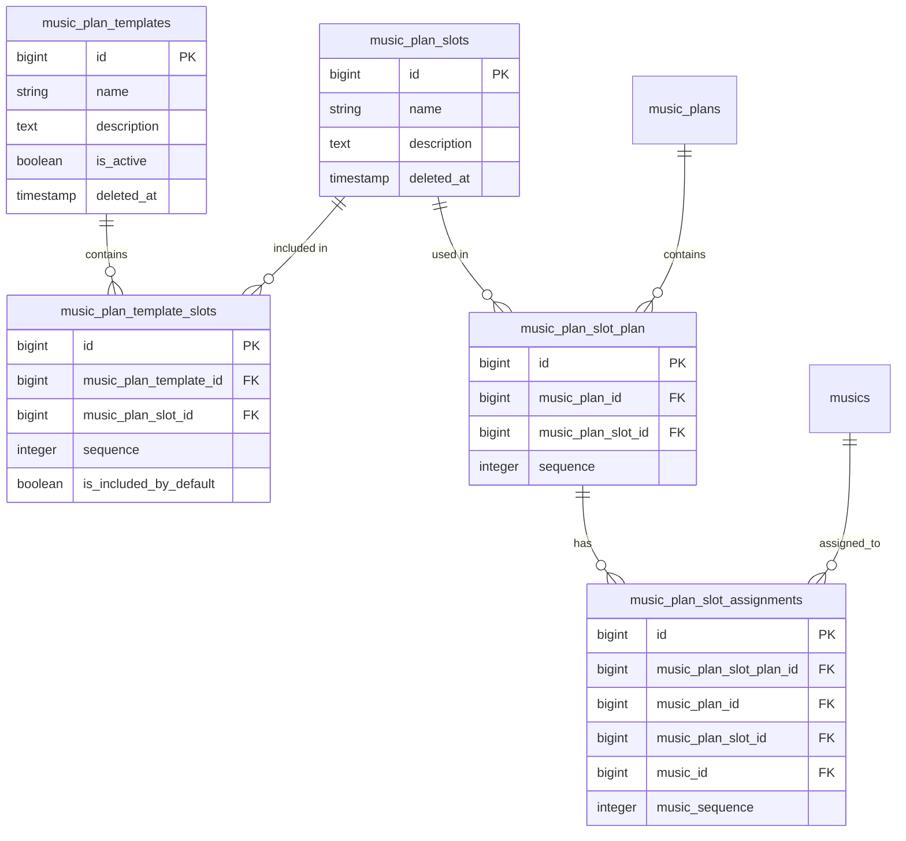

# MusicPlan Templates Design Document

## Overview
MusicPlan Templates provide a way to define standard structures for Mass music plans. Slots are independent entities that can be reused across templates. Templates collect slots with specific ordering and indicate whether each slot is automatically included when creating a music plan from the template.

## Current Implementation Status
The templates system is fully implemented and includes:
- Global slot management (`MusicPlanSlot`)
- Template management (`MusicPlanTemplate`) 
- Template-slot relationships with ordering and inclusion flags (`music_plan_template_slots`)
- Admin interfaces for managing all components
- Integration with MusicPlan editor for template-based plan creation

## Database Schema

### Table: `music_plan_slots`
| Column | Type | Description | Constraints |
|--------|------|-------------|-------------|
| `id` | bigint | Primary key | AUTO_INCREMENT |
| `name` | string | Slot name (e.g., "Entrance Procession", "Kyrie") | NULLABLE |
| `description` | text | Optional description of the slot | NULLABLE |
| `created_at` | timestamp | When the record was created | NULLABLE |
| `updated_at` | timestamp | When the record was last updated | NULLABLE |
| `deleted_at` | timestamp | Soft delete timestamp | NULLABLE |

**Indexes:**
1. Primary key: `id`
2. Name index: `name` for searching
3. Soft delete filter: `deleted_at` for active records

### Table: `music_plan_templates`
| Column | Type | Description | Constraints |
|--------|------|-------------|-------------|
| `id` | bigint | Primary key | AUTO_INCREMENT |
| `name` | string | Template name (e.g., "Mass", "Sunday Mass", "Wedding Mass") | NULLABLE |
| `description` | text | Optional description of the template | NULLABLE |
| `is_active` | boolean | Whether the template is active (can be used) | DEFAULT true |
| `created_at` | timestamp | When the record was created | NULLABLE |
| `updated_at` | timestamp | When the record was last updated | NULLABLE |
| `deleted_at` | timestamp | Soft delete timestamp | NULLABLE |

**Indexes:**
1. Primary key: `id`
2. Active templates index: `is_active` for filtering
3. Name index: `name` for searching
4. Soft delete filter: `deleted_at` for active records

### Table: `music_plan_template_slots` (Pivot table with ordering and inclusion)
| Column | Type | Description | Constraints |
|--------|------|-------------|-------------|
| `id` | bigint | Primary key | AUTO_INCREMENT |
| `music_plan_template_id` | bigint | Foreign key to music_plan_templates | NOT NULL |
| `music_plan_slot_id` | bigint | Foreign key to music_plan_slots | NOT NULL |
| `sequence` | integer | Order of the slot within the template | NOT NULL, DEFAULT 1 |
| `is_included_by_default` | boolean | Whether this slot is automatically included in music plans created from this template | DEFAULT true |
| `created_at` | timestamp | When the record was created | NULLABLE |
| `updated_at` | timestamp | When the record was last updated | NULLABLE |

**Indexes:**
1. Primary key: `id`
2. Foreign key indexes: `music_plan_template_id`, `music_plan_slot_id`
3. Template ordering index: `(music_plan_template_id, sequence)` for efficient ordering
4. Unique constraint: `(music_plan_template_id, music_plan_slot_id)` to prevent duplicate slots in same template
5. Inclusion index: `is_included_by_default` for filtering

**Foreign Keys:**
- `music_plan_template_slots.music_plan_template_id` → `music_plan_templates.id` (cascade on delete)
- `music_plan_template_slots.music_plan_slot_id` → `music_plan_slots.id` (restrict on delete)

### Related Tables (for context)

#### Table: `music_plan_slot_plan` (MusicPlan-Slot pivot)
Connects MusicPlans to Slots with ordering:
- `music_plan_id` → `music_plans.id` (cascade)
- `music_plan_slot_id` → `music_plan_slots.id` (restrict)
- `sequence` - order within the music plan

#### Table: `music_plan_slot_assignments`
Assigns Music to specific slot instances within a MusicPlan:
- `music_plan_slot_plan_id` → `music_plan_slot_plan.id` (cascade)
- `music_plan_id` → `music_plans.id` (cascade) 
- `music_plan_slot_id` → `music_plan_slots.id` (restrict)
- `music_id` → `musics.id` (cascade)
- `music_sequence` - order of music within the slot instance

## Relationships Diagram



## Eloquent Model Design

### Model: `MusicPlanSlot`
Located at `app/Models/MusicPlanSlot.php`

```php
<?php

namespace App\Models;

use Illuminate\Database\Eloquent\Model;
use Illuminate\Database\Eloquent\Relations\BelongsToMany;
use Illuminate\Database\Eloquent\SoftDeletes;

class MusicPlanSlot extends Model
{
    use SoftDeletes;

    /**
     * The attributes that are mass assignable.
     *
     * @var list<string>
     */
    protected $fillable = [
        'name',
        'description',
    ];

    /**
     * Get the attributes that should be cast.
     *
     * @return array<string, string>
     */
    protected function casts(): array
    {
        return [
            'deleted_at' => 'datetime',
        ];
    }

    /**
     * Get the templates that include this slot.
     */
    public function templates(): BelongsToMany
    {
        return $this->belongsToMany(MusicPlanTemplate::class, 'music_plan_template_slots')
            ->withPivot(['sequence', 'is_included_by_default'])
            ->orderByPivot('sequence');
    }

    /**
     * Get the music assignments for this slot.
     */
    public function musicAssignments()
    {
        return $this->hasMany(MusicPlanSlotAssignment::class);
    }

    /**
     * Get the music items assigned to this slot (through assignments).
     */
    public function assignedMusic(): \Illuminate\Database\Eloquent\Relations\HasManyThrough
    {
        return $this->hasManyThrough(
            Music::class,
            MusicPlanSlotAssignment::class,
            'music_plan_slot_id',
            'id',
            'id',
            'music_id'
        );
    }

    /**
     * Scope for active slots (not soft deleted).
     */
    public function scopeActive($query)
    {
        return $query->whereNull('deleted_at');
    }
}
```

### Model: `MusicPlanTemplate`
Located at `app/Models/MusicPlanTemplate.php`

```php
<?php

namespace App\Models;

use Illuminate\Database\Eloquent\Model;
use Illuminate\Database\Eloquent\Relations\BelongsToMany;
use Illuminate\Database\Eloquent\SoftDeletes;

class MusicPlanTemplate extends Model
{
    use SoftDeletes;

    /**
     * The attributes that are mass assignable.
     *
     * @var list<string>
     */
    protected $fillable = [
        'name',
        'description',
        'is_active',
    ];

    /**
     * Get the attributes that should be cast.
     *
     * @return array<string, string>
     */
    protected function casts(): array
    {
        return [
            'is_active' => 'boolean',
            'deleted_at' => 'datetime',
        ];
    }

    /**
     * Get the slots for this template with ordering and inclusion info.
     */
    public function slots(): BelongsToMany
    {
        return $this->belongsToMany(MusicPlanSlot::class, 'music_plan_template_slots')
            ->withPivot(['sequence', 'is_included_by_default'])
            ->orderByPivot('sequence');
    }

    /**
     * Get only slots included by default.
     */
    public function defaultSlots()
    {
        return $this->slots()->wherePivot('is_included_by_default', true);
    }

    /**
     * Get only advanced (optional) slots.
     */
    public function advancedSlots()
    {
        return $this->slots()->wherePivot('is_included_by_default', false);
    }

    /**
     * Scope for active templates.
     */
    public function scopeActive($query)
    {
        return $query->where('is_active', true);
    }

    /**
     * Scope for including slots.
     */
    public function scopeWithSlots($query)
    {
        return $query->with('slots');
    }

    /**
     * Attach a slot to the template with sequence and inclusion flag.
     */
    public function attachSlot(MusicPlanSlot $slot, int $sequence, bool $isIncludedByDefault = true): void
    {
        $this->slots()->attach($slot->id, [
            'sequence' => $sequence,
            'is_included_by_default' => $isIncludedByDefault,
        ]);
    }

    /**
     * Update a slot's sequence and inclusion flag.
     */
    public function updateSlot(MusicPlanSlot $slot, int $sequence, bool $isIncludedByDefault): void
    {
        $this->slots()->updateExistingPivot($slot->id, [
            'sequence' => $sequence,
            'is_included_by_default' => $isIncludedByDefault,
        ]);
    }

    /**
     * Detach a slot from the template.
     */
    public function detachSlot(MusicPlanSlot $slot): void
    {
        $this->slots()->detach($slot->id);
    }
}
```

### Pivot Model: `MusicPlanTemplateSlot`
Located at `app/Models/MusicPlanTemplateSlot.php`

```php
<?php

namespace App\Models;

use Illuminate\Database\Eloquent\Relations\Pivot;

class MusicPlanTemplateSlot extends Pivot
{
    /**
     * The table associated with the model.
     *
     * @var string
     */
    protected $table = 'music_plan_template_slots';

    /**
     * Indicates if the IDs are auto-incrementing.
     *
     * @var bool
     */
    public $incrementing = true;

    /**
     * The attributes that are mass assignable.
     *
     * @var list<string>
     */
    protected $fillable = [
        'music_plan_template_id',
        'music_plan_slot_id',
        'sequence',
        'is_included_by_default',
    ];

    /**
     * Get the attributes that should be cast.
     *
     * @return array<string, string>
     */
    protected function casts(): array
    {
        return [
            'sequence' => 'integer',
            'is_included_by_default' => 'boolean',
        ];
    }
}
```

## Template Usage in MusicPlan Editor

### How Templates Integrate with Music Plans
1. **Template Selection**: Users can browse available templates in the MusicPlan editor
2. **Slot Addition**: Users can add individual slots or all slots from a template
3. **Default vs Advanced**: Templates distinguish between default (automatically included) and advanced (optional) slots
4. **Flexible Application**: Users can mix and match slots from multiple templates

### Template Application Flow
```php
// In MusicPlan editor Livewire component
public function addSlotsFromTemplate(int $templateId): void
{
    $template = MusicPlanTemplate::with(['slots' => function ($query) {
        $query->orderByPivot('sequence');
    }])->findOrFail($templateId);

    // Get existing slots for this plan to determine next sequence
    $existingSlots = $this->musicPlan->slots()->count();
    $sequence = $existingSlots + 1;

    $addedCount = 0;
    foreach ($template->slots as $slot) {
        $this->musicPlan->slots()->attach($slot->id, [
            'sequence' => $sequence,
        ]);
        $sequence++;
        $addedCount++;
    }

    // Reload plan slots
    $this->loadPlanSlots();
}
```

### Default Slots Only Application
```php
public function addDefaultSlotsFromTemplate(int $templateId): void
{
    $template = MusicPlanTemplate::with(['slots' => function ($query) {
        $query->orderByPivot('sequence');
    }])->findOrFail($templateId);

    $existingSlots = $this->musicPlan->slots()->count();
    $sequence = $existingSlots + 1;

    $addedCount = 0;
    foreach ($template->slots as $slot) {
        if ($slot->pivot->is_included_by_default) {
            $this->musicPlan->slots()->attach($slot->id, [
                'sequence' => $sequence,
            ]);
            $sequence++;
            $addedCount++;
        }
    }

    $this->loadPlanSlots();
}
```

## Admin Interface Implementation

### Livewire Components

#### 1. `MusicPlanSlots` Component
Location: `app/Livewire/Pages/Admin/MusicPlanSlots.php`
- Lists all music plan slots with pagination
- Create, edit, and soft delete slots
- Search functionality
- Shows which templates use each slot

#### 2. `MusicPlanTemplates` Component  
Location: `app/Livewire/Pages/Admin/MusicPlanTemplates.php`
- Lists all music plan templates with pagination
- Create, edit, activate/deactivate, and soft delete templates
- Search functionality
- Shows slot count and provides link to manage template slots

#### 3. `MusicPlanTemplateSlots` Component
Location: `app/Livewire/Pages/Admin/MusicPlanTemplateSlots.php`
- Manages slots for a specific template
- Add existing slots to template with sequence and inclusion flag
- Remove slots from template
- Edit sequence and inclusion flag for existing template slots
- Shows available slots not yet in the template

### Routes
```
# Admin Routes (routes/admin.php)
Route::middleware(['auth', 'verified', 'admin'])->prefix('admin')->group(function () {
    Route::livewire('music-plan-slots', 'pages::admin.music-plan-slots')
        ->name('admin.music-plan-slots');
    Route::livewire('music-plan-templates', 'pages::admin.music-plan-templates')
        ->name('admin.music-plan-templates');
    Route::livewire('music-plan-templates/{template}/slots', 'pages::admin.music-plan-template-slots')
        ->name('admin.music-plan-template-slots');
});
```

### Admin Navigation
Updated in `resources/views/pages/admin/layout.blade.php`:
```blade
<flux:navlist.group :label="__('Music Plan Templates')">
    <flux:navlist.item :href="route('admin.music-plan-slots')" wire:navigate 
        :current="request()->routeIs('admin.music-plan-slots')">
        {{ __('Slots') }}
    </flux:navlist.item>
    <flux:navlist.item :href="route('admin.music-plan-templates')" wire:navigate 
        :current="request()->routeIs('admin.music-plan-templates')">
        {{ __('Templates') }}
    </flux:navlist.item>
</flux:navlist.group>
```

## Form Request Classes

### `StoreMusicPlanSlotRequest`
Location: `app/Http/Requests/StoreMusicPlanSlotRequest.php`
```php
<?php

namespace App\Http\Requests;

use Illuminate\Foundation\Http\FormRequest;
use Illuminate\Validation\Rule;

class StoreMusicPlanSlotRequest extends FormRequest
{
    public function authorize(): bool
    {
        return $this->user()?->isAdmin() ?? false;
    }

    public function rules(): array
    {
        return [
            'name' => [
                'required',
                'string',
                'max:255',
                Rule::unique('music_plan_slots', 'name')->whereNull('deleted_at'),
            ],
            'description' => ['nullable', 'string', 'max:1000'],
        ];
    }
}
```

### `UpdateMusicPlanSlotRequest`
Location: `app/Http/Requests/UpdateMusicPlanSlotRequest.php`
```php
<?php

namespace App\Http\Requests;

use Illuminate\Foundation\Http\FormRequest;
use Illuminate\Validation\Rule;

class UpdateMusicPlanSlotRequest extends FormRequest
{
    public function authorize(): bool
    {
        return $this->user()?->isAdmin() ?? false;
    }

    public function rules(): array
    {
        return [
            'name' => [
                'required',
                'string',
                'max:255',
                Rule::unique('music_plan_slots', 'name')
                    ->whereNull('deleted_at')
                    ->ignore($this->route('music_plan_slot')),
            ],
            'description' => ['nullable', 'string', 'max:1000'],
        ];
    }
}
```

### `StoreMusicPlanTemplateRequest`
Location: `app/Http/Requests/StoreMusicPlanTemplateRequest.php`
```php
<?php

namespace App\Http\Requests;

use Illuminate\Foundation\Http\FormRequest;
use Illuminate\Validation\Rule;

class StoreMusicPlanTemplateRequest extends FormRequest
{
    public function authorize(): bool
    {
        return $this->user()?->isAdmin() ?? false;
    }

    public function rules(): array
    {
        return [
            'name' => [
                'required',
                'string',
                'max:255',
                Rule::unique('music_plan_templates', 'name')->whereNull('deleted_at'),
            ],
            'description' => ['nullable', 'string', 'max:1000'],
            'is_active' => ['boolean'],
        ];
    }
}
```

### `UpdateMusicPlanTemplateRequest`
Location: `app/Http/Requests/UpdateMusicPlanTemplateRequest.php`
```php
<?php

namespace App\Http\Requests;

use Illuminate\Foundation\Http\FormRequest;
use Illuminate\Validation\Rule;

class UpdateMusicPlanTemplateRequest extends FormRequest
{
    public function authorize(): bool
    {
        return $this->user()?->isAdmin() ?? false;
    }

    public function rules(): array
    {
        return [
            'name' => [
                'required',
                'string',
                'max:255',
                Rule::unique('music_plan_templates', 'name')
                    ->whereNull('deleted_at')
                    ->ignore($this->route('music_plan_template')),
            ],
            'description' => ['nullable', 'string', 'max:1000'],
            'is_active' => ['boolean'],
        ];
    }
}
```

### `StoreMusicPlanTemplateSlotRequest`
Location: `app/Http/Requests/StoreMusicPlanTemplateSlotRequest.php`
```php
<?php

namespace App\Http\Requests;

use Illuminate\Foundation\Http\FormRequest;

class StoreMusicPlanTemplateSlotRequest extends FormRequest
{
    public function authorize(): bool
    {
        return $this->user()?->isAdmin() ?? false;
    }

    public function rules(): array
    {
        return [
            'slot_id' => ['required', 'exists:music_plan_slots,id'],
            'sequence' => ['required', 'integer', 'min:1'],
            'is_included_by_default' => ['boolean'],
        ];
    }
}
```

### `UpdateMusicPlanTemplateSlotRequest`
Location: `app/Http/Requests/UpdateMusicPlanTemplateSlotRequest.php`
```php
<?php

namespace App\Http\Requests;

use Illuminate\Foundation\Http\FormRequest;

class UpdateMusicPlanTemplateSlotRequest extends FormRequest
{
    public function authorize(): bool
    {
        return $this->user()?->isAdmin() ?? false;
    }

    public function rules(): array
    {
        return [
            'sequence' => ['required', 'integer', 'min:1'],
            'is_included_by_default' => ['boolean'],
        ];
    }
}
```

## Testing

### Test Files Structure
```
tests/Feature/MusicPlanTemplates/
├── MusicPlanSlotTest.php
├── MusicPlanTemplateTest.php
└── MusicPlanTemplateSlotTest.php
```

### Key Test Scenarios
1. **Admin Authorization**: Only admins can access template management
2. **CRUD Operations**: Create, read, update, delete for slots and templates
3. **Soft Delete**: Slots and templates can be soft deleted
4. **Template-Slot Relationships**: Slots can be added/removed from templates with proper ordering
5. **Unique Constraints**: Slot names must be unique (when active), slots can't be added twice to same template
6. **Cascading Deletes**: Deleting a template cascades to template-slot relationships
7. **Restricted Deletes**: Slots used in templates cannot be hard deleted (foreign key constraint)

### Example Test: Adding Slot to Template
```php
test('admin can add slot to template', function () {
    $admin = User::factory()->admin()->create();
    $template = MusicPlanTemplate::factory()->create();
    $slot = MusicPlanSlot::factory()->create();
    
    $this->actingAs($admin)
        ->livewire('pages::admin.music-plan-template-slots', ['template' => $template])
        ->set('slot_id', $slot->id)
        ->set('sequence', 1)
        ->set('is_included_by_default', true)
        ->call('addSlot')
        ->assertDispatched('slot-added');
    
    $this->assertDatabaseHas('music_plan_template_slots', [
        'template_id' => $template->id,
        'slot_id' => $slot->id,
        'sequence' => 1,
        'is_included_by_default' => true,
    ]);
});
```

## Usage in MusicPlan Editor

### Template Display in Editor
The MusicPlan editor (`resources/views/pages/music-plan/music-plan-editor.blade.php`) includes:
1. **Template List**: Collapsible cards showing available templates
2. **Template Details**: Name, description, slot count
3. **Action Buttons**: 
   - "Add All": Add all slots from template
   - "Add Default": Add only default slots from template
   - Individual slot addition from expanded view
4. **Slot Information**: Shows sequence and whether slot is included by default

### Template Data Loading
```php
private function loadAvailableTemplates(): void
{
    $this->availableTemplates = MusicPlanTemplate::active()
        ->with(['slots' => function ($query) {
            $query->orderByPivot('sequence');
        }])
        ->get()
        ->map(function ($template) {
            return [
                'id' => $template->id,
                'name' => $template->name,
                'description' => $template->description,
                'slot_count' => $template->slots->count(),
                'slots' => $template->slots->map(function ($slot) {
                    return [
                        'id' => $slot->id,
                        'name' => $slot->name,
                        'description' => $slot->description,
                        'sequence' => $slot->pivot->sequence,
                        'is_included_by_default' => $slot->pivot->is_included_by_default,
                    ];
                })->toArray(),
            ];
        })
        ->toArray();
}
```

## Best Practices

### 1. Slot Naming Convention
- Use clear, descriptive names (e.g., "Entrance Procession", "Kyrie", "Gloria")
- Avoid abbreviations unless widely understood
- Consider liturgical context

### 2. Template Organization
- Create templates for common Mass types (Sunday Mass, Wedding Mass, Funeral Mass)
- Use descriptive template names
- Include helpful descriptions for template purpose

### 3. Default vs Advanced Slots
- **Default Slots**: Core elements that should always be included (e.g., Gloria, Sanctus)
- **Advanced Slots**: Optional elements for specific occasions (e.g., Sequence, Additional Hymns)

### 4. Soft Delete Strategy
- Slots and templates are soft deleted to preserve historical data
- Soft deleted items don't appear in active listings
- Foreign key constraints prevent hard deletion of in-use items

### 5. Performance Considerations
- Eager load template slots when displaying template lists
- Use database indexes for frequently queried columns
- Cache template data if templates change infrequently

## Future Enhancements

### 1. Template Versioning
- Track changes to templates over time
- Allow reverting to previous versions
- Show template history

### 2. Template Import/Export
- Export templates as JSON for sharing
- Import templates from external sources
- Template marketplace for community sharing

### 3. Advanced Slot Configuration
- Slot categories (e.g., "Ordinary", "Proper", "Hymns")
- Slot dependencies (e.g., "Gloria" requires "Kyrie")
- Slot alternatives (e.g., "Gloria" or "Gloria in Excelsis")

### 4. Template Analytics
- Track most-used templates
- Show template popularity metrics
- Identify unused slots

## Maintenance Guidelines

### Regular Tasks
1. **Review Unused Slots**: Periodically check for slots not used in any templates
2. **Template Updates**: Update templates to reflect liturgical changes
3. **Cleanup**: Permanently delete old soft-deleted items after appropriate retention period

### Data Integrity Checks
1. **Orphaned Records**: Check for template slots referencing deleted slots
2. **Sequence Gaps**: Ensure template slot sequences are contiguous
3. **Active Status**: Verify active templates have at least one slot

### Backup Strategy
1. **Regular Backups**: Include template data in database backups
2. **Export Templates**: Periodically export templates as backup
3. **Version Control**: Consider storing template definitions in version control

## Conclusion

The MusicPlan Templates system provides a flexible, reusable way to structure music plans for Catholic Masses. By separating slot definitions from template organization, the system supports both standardization (through templates) and customization (through manual slot management).

The implementation follows Laravel best practices with proper model relationships, form validation, admin authorization, and comprehensive testing. The UI integrates seamlessly with the existing MusicPlan editor, providing users with intuitive template-based plan creation.