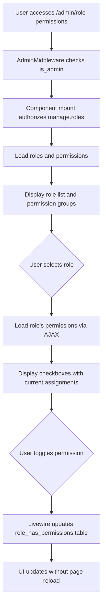

# Permission Assignment Feature - Architecture Design

## Overview
Design for a permission assignment feature in the Laravel admin panel using spatie/laravel-permission package. This feature allows administrators to assign permissions to roles with a clean, intuitive UI using Livewire 4 and Flux UI Free components.

## Current State Analysis

### Existing Admin Structure
- **Admin Layout**: Uses `resources/views/pages/admin/layout.blade.php` with Flux UI navigation
- **Routes**: Admin routes defined in `routes/admin.php` with middleware `['auth', 'verified', 'admin']`
- **Middleware**: `AdminMiddleware` checks `is_admin` boolean field on User model
- **Existing Admin Pages**: Users, Music Plan Slots, Music Plan Templates, Bulk Imports, Nickname Data

### Permission System
- **Package**: spatie/laravel-permission (v6.x)
- **Configuration**: `config/permission.php` uses default Spatie models
- **Database**: Tables exist (`roles`, `permissions`, `role_has_permissions`, etc.)
- **Current Roles**: `admin`, `editor`, `contributor` (3 total)
- **Current Permissions**: ~40 permissions including `manage.roles`, `role.assign`, `access.admin`, etc.
- **User Model**: Uses `HasRoles` trait from Spatie

### UI Patterns
- **Component Structure**: Single-file Livewire components with inline PHP
- **Layout**: Uses `<x-pages::admin.layout>` wrapper with heading/subheading
- **Tables**: `<flux:table>` with sortable columns, search, and action buttons
- **Forms**: Modal-based creation/editing with Flux UI form components
- **State Management**: Livewire properties with real-time updates

## Design Requirements

### Functional Requirements
1. Display list of roles with ability to select a role
2. Display permissions grouped by resource/type for selected role
3. Checkbox interface to assign/unassign permissions
4. Real-time updates without page reload
5. Search/filter for roles and permissions
6. Authorization: Only users with `is_admin = true` AND `manage.roles` permission can access
7. Follow existing admin design patterns

### Non-Functional Requirements
1. Responsive design
2. Performance with growing number of permissions (40+)
3. Consistent with existing Flux UI styling
4. Accessible UI components
5. Proper validation and error handling

## Architecture Design

### 1. Livewire Component Structure

#### Primary Component: `RolePermissionManager`
- **Location**: `app/Livewire/Pages/Admin/RolePermissionManager.php`
- **Type**: Single-file component (PHP + Blade)
- **Pattern**: Follows existing admin component patterns (similar to `MusicPlanSlots`)

#### Component Properties:
```php
public $selectedRoleId = null;
public $searchRoles = '';
public $searchPermissions = '';
public $roles = [];
public $permissions = [];
public $rolePermissions = []; // Array of permission IDs for selected role
public $groupedPermissions = []; // Permissions grouped by resource
```

#### Component Methods:
- `mount()`: Authorize access, load initial data
- `selectRole($roleId)`: Set selected role, load its permissions
- `loadRoles()`: Fetch roles with optional search
- `loadPermissions()`: Fetch permissions with optional search, group by resource
- `togglePermission($permissionId)`: Assign/unassign permission to selected role
- `savePermissions()`: Batch update permissions for selected role
- `resetSelection()`: Clear selected role

### 2. Data Flow



### 3. UI Layout Design

#### Page Structure:
```
+---------------------------------------------------------------------------+
| Admin Navigation                                                          |
+-------------------+-------------------------------------------------------+
|                   |                                                       |
|  Roles List       |  Permission Assignment Area                          |
|  - Search input   |                                                       |
|  - Role cards     |  When role selected:                                 |
|    [Admin] ✓      |  + Role header (admin)                               |
|    [Editor]       |  + Search permissions input                          |
|    [Contributor]  |  + Permission groups (accordion)                     |
|                   |    • Music Permissions (8)                           |
|                   |      ☑ music.create ☑ music.update ☐ music.delete   |
|                   |    • User Permissions (5)                            |
|                   |      ☑ user.view ☐ user.create ☐ user.delete        |
|                   |  + Save button                                       |
|                   |                                                       |
+-------------------+-------------------------------------------------------+
```

#### UI Components:
- **Role Selection**: `<flux:card>` list with selection state
- **Permission Groups**: `<flux:accordion>` for collapsible groups
- **Checkboxes**: `<flux:checkbox>` with labels
- **Search**: `<flux:input type="search">` with live search
- **Actions**: `<flux:button>` for save/reset

### 4. Route Integration

#### New Route in `routes/admin.php`:
```php
Route::livewire('role-permissions', \App\Livewire\Pages\Admin\RolePermissionManager::class)
    ->name('admin.role-permissions');
```

#### Navigation Update in `resources/views/pages/admin/layout.blade.php`:
Add new nav item under appropriate group:
```blade
<flux:navlist.group :label="__('System')">
    <flux:navlist.item :href="route('admin.role-permissions')" wire:navigate :current="request()->routeIs('admin.role-permissions')">
        {{ __('Role & Permissions') }}
    </flux:navlist.item>
</flux:navlist.group>
```

### 5. Database Considerations

#### Existing Tables (No changes needed):
- `roles`: id, name, guard_name, created_at, updated_at
- `permissions`: id, name, guard_name, created_at, updated_at  
- `role_has_permissions`: role_id, permission_id (pivot table)

#### Optimization:
- Indexes already exist via Spatie migrations
- Consider caching role-permission relationships if performance becomes issue

### 6. Security & Authorization

#### Access Control:
1. **Route Middleware**: `['auth', 'verified', 'admin']` (existing)
2. **Component Authorization**: `$this->authorize('manage.roles')` in `mount()`
3. **Hybrid Approach**: 
   - `is_admin = true` required for admin panel access (existing)
   - `manage.roles` permission required for permission assignment (new)

#### Permission Requirements:
- Users need both `is_admin = true` AND `manage.roles` permission
- The `manage.roles` permission should be assigned to admin role by default

#### Validation:
- Validate role exists before assignment
- Validate permission exists before toggling
- Prevent self-removal of critical permissions

### 7. File Structure

```
app/
├── Livewire/
│   └── Pages/
│       └── Admin/
│           └── RolePermissionManager.php
resources/
└── views/
    └── pages/
        └── admin/
            └── ⚡role-permissions.blade.php
```

### 8. Component Implementation Details

#### RolePermissionManager.php Structure:
```php
<?php

namespace App\Livewire\Pages\Admin;

use Illuminate\Contracts\View\View;
use Illuminate\Foundation\Auth\Access\AuthorizesRequests;
use Livewire\Component;
use Spatie\Permission\Models\Role;
use Spatie\Permission\Models\Permission;

class RolePermissionManager extends Component
{
    use AuthorizesRequests;

    public $selectedRoleId = null;
    public $searchRoles = '';
    public $searchPermissions = '';
    public $rolePermissions = [];
    
    public function mount(): void
    {
        $this->authorize('manage.roles');
    }
    
    public function selectRole($roleId): void
    {
        $this->selectedRoleId = $roleId;
        $this->loadRolePermissions();
    }
    
    public function togglePermission($permissionId): void
    {
        // Implementation
    }
    
    public function render(): View
    {
        return view('livewire.pages.admin.role-permission-manager', [
            'roles' => $this->getRoles(),
            'groupedPermissions' => $this->getGroupedPermissions(),
        ]);
    }
}
```

#### Blade Template Key Features:
- Two-panel responsive layout
- Real-time search filtering
- Permission grouping by resource prefix (e.g., "music.", "user.")
- Visual feedback for changes
- Loading states during updates

### 9. Testing Strategy (Future Implementation)

#### Feature Tests:
- Test access control (with/without `manage.roles` permission)
- Test permission assignment/unassignment
- Test search functionality
- Test validation and error cases

#### Browser Tests:
- Test UI interactions
- Test responsive behavior
- Test accessibility

## Implementation Checklist

### Phase 1: Foundation
- [ ] Create `RolePermissionManager` Livewire component
- [ ] Create blade template with basic layout
- [ ] Add route to `routes/admin.php`
- [ ] Update admin navigation

### Phase 2: Core Functionality
- [ ] Implement role selection and display
- [ ] Implement permission loading and grouping
- [ ] Implement checkbox toggling with Livewire
- [ ] Implement search/filter for roles and permissions

### Phase 3: Polish & Validation
- [ ] Add authorization checks
- [ ] Add validation and error handling
- [ ] Add loading states and feedback
- [ ] Style to match existing admin pages

### Phase 4: Testing
- [ ] Write feature tests
- [ ] Write browser tests (if applicable)
- [ ] Test with different user roles/permissions

## Dependencies & Constraints

### Technical Constraints:
- Laravel 12 structure (bootstrap/app.php for middleware)
- Livewire 4 compatibility
- Flux UI Free components only
- PostgreSQL database
- Existing spatie/laravel-permission setup

### Design Constraints:
- Follow existing admin UI patterns
- Use Flux UI components where possible
- Maintain responsive design
- Ensure accessibility compliance

## Risk Assessment

### Low Risk:
- Uses existing permission system
- Follows established patterns
- No database schema changes needed

### Medium Risk:
- Authorization logic changes (adding `manage.roles` requirement)
- Potential performance with many permissions (mitigated by search/grouping)

### Mitigation Strategies:
- Thorough testing of authorization logic
- Performance testing with large permission sets
- Gradual rollout with monitoring

## Success Metrics

1. **Functional**: Administrators can assign/unassign permissions to roles
2. **Performance**: Page loads < 2 seconds with 50+ permissions
3. **Usability**: Intuitive UI with clear feedback
4. **Security**: Proper authorization enforced at all levels
5. **Maintainability**: Code follows existing patterns and conventions

## Next Steps

1. **Review this design** with stakeholders
2. **Implement in Code mode** following the checklist
3. **Test thoroughly** before deployment
4. **Document** any deviations from design

---

*Design created based on analysis of existing admin structure, permission configuration, and UI patterns.*
*Last updated: 2026-02-18*