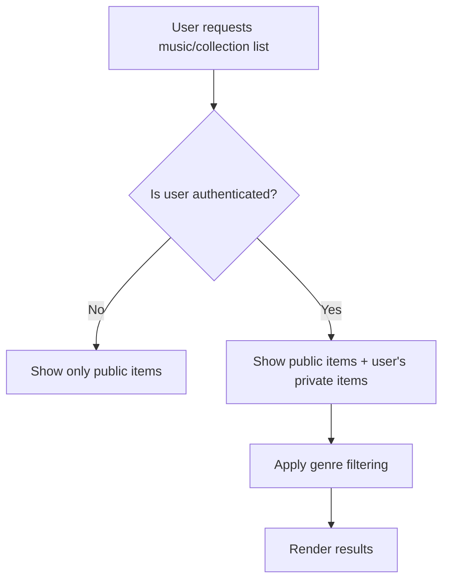
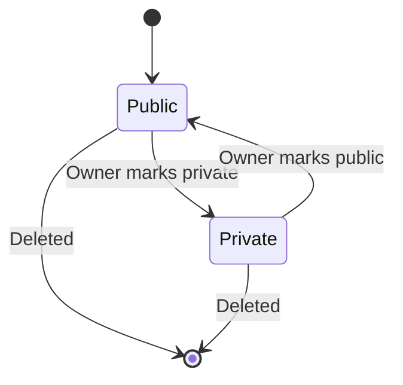

# Private/Unpublished Functionality Implementation Plan

## Overview
This plan outlines the schema changes and code updates required to implement private/unpublished functionality for Musics, Collections, and MusicPlans in the Laravel application.

## Current State Analysis

### Database Schema
- **musics table**: `id`, `title`, `subtitle`, `custom_id`, `user_id` (nullable), `created_at`, `updated_at`
- **collections table**: `id`, `title`, `abbreviation`, `author`, `user_id` (nullable), `created_at`, `updated_at`
- **music_plans table**: `id`, `user_id`, `genre_id`, `is_published` (boolean, default false), `created_at`, `updated_at`

### Models
- **Music**: No `is_private` property, no cast, no scopes for privacy.
- **Collection**: No `is_private` property, no cast, no scopes for privacy.
- **MusicPlan**: Has `is_published` cast, `published()` and `private()` scopes.

### Policies
- **MusicPolicy**: Allows any authenticated user to view any music (`viewAny` and `view` return true).
- **CollectionPolicy**: Same as MusicPolicy.
- **MusicPlanPolicy**: Correctly implements visibility: published plans visible to all, private plans only to owner.

### UI Components
- **Editor/Musics**: Lists all music filtered by genre, no privacy filtering.
- **Editor/Collections**: Lists all collections filtered by genre, no privacy filtering.
- **MyMusicPlans**: Lists only user's own music plans (filtered by `user_id`).
- **Music search component**: Used in music plan editor; currently searches all music.

## Requirements
1. Musics and Collections can be private (default not private). Private means "not published" but with different connotation.
2. They can be made private during or after creation.
3. Music plans start unpublished and stay that way until published (already satisfied).

## Implementation Plan

### 1. Database Migrations

#### Migration 1: Add `is_private` to musics table
**File**: `database/migrations/2026_02_16_XXXXXX_add_is_private_to_musics_table.php`

```php
<?php

use Illuminate\Database\Migrations\Migration;
use Illuminate\Database\Schema\Blueprint;
use Illuminate\Support\Facades\Schema;

return new class extends Migration
{
    public function up(): void
    {
        Schema::table('musics', function (Blueprint $table) {
            $table->boolean('is_private')->default(false);
            $table->index(['user_id', 'is_private']);
        });
    }

    public function down(): void
    {
        Schema::table('musics', function (Blueprint $table) {
            $table->dropIndex(['user_id', 'is_private']);
            $table->dropColumn('is_private');
        });
    }
};
```

#### Migration 2: Add `is_private` to collections table
**File**: `database/migrations/2026_02_16_XXXXXX_add_is_private_to_collections_table.php`

```php
<?php

use Illuminate\Database\Migrations\Migration;
use Illuminate\Database\Schema\Blueprint;
use Illuminate\Support\Facades\Schema;

return new class extends Migration
{
    public function up(): void
    {
        Schema::table('collections', function (Blueprint $table) {
            $table->boolean('is_private')->default(false);
            $table->index(['user_id', 'is_private']);
        });
    }

    public function down(): void
    {
        Schema::table('collections', function (Blueprint $table) {
            $table->dropIndex(['user_id', 'is_private']);
            $table->dropColumn('is_private');
        });
    }
};
```

**Note**: No migration needed for `music_plans` as `is_published` already exists.

### 2. Model Updates

#### Music Model (`app/Models/Music.php`)
- Add `is_private` to `$fillable` array.
- Add cast in `casts()` method (or create `casts()` method if not exists).
- Add visibility scopes.

```php
protected $fillable = [
    'title',
    'subtitle',
    'custom_id',
    'user_id',
    'is_private', // added
];

protected function casts(): array
{
    return [
        'is_private' => 'boolean',
    ];
}

// Scopes
public function scopePublic($query)
{
    return $query->where('is_private', false);
}

public function scopePrivate($query)
{
    return $query->where('is_private', true);
}

public function scopeVisibleTo($query, ?User $user = null)
{
    $userId = $user?->id;
    
    if (!$userId) {
        // Guest can only see public items
        return $query->where('is_private', false);
    }
    
    return $query->where(function ($q) use ($userId) {
        $q->where('is_private', false)
            ->orWhere('user_id', $userId);
    });
}
```

#### Collection Model (`app/Models/Collection.php`)
- Similar updates as Music model.

#### MusicPlan Model (`app/Models/MusicPlan.php`)
- Already has `is_published` cast and scopes. Ensure `visibleTo` scope consistency.

### 3. Policy Updates

#### MusicPolicy (`app/Policies/MusicPolicy.php`)
- Update `view` method to check privacy:

```php
public function view(User $user, Music $music): bool
{
    // If music is not private, anyone can view
    if (!$music->is_private) {
        return true;
    }
    
    // Private music only visible to owner or admin
    return $user->is_admin || $music->user_id === $user->id;
}
```

- `viewAny` remains true (filtering done via scopes).

#### CollectionPolicy (`app/Policies/CollectionPolicy.php`)
- Same updates as MusicPolicy.

#### MusicPlanPolicy (`app/Policies/MusicPlanPolicy.php`)
- Already correct.

### 4. Query Scopes Integration

Update all queries that list music/collections to use `visibleTo` scope:

#### Editor/Musics Component (`app/Livewire/Pages/Editor/Musics.php`)
```php
public function render(): View
{
    $musics = Music::visibleTo(auth()->user())
        ->when($this->search, function ($query, $search) {
            $query->search($search);
        })
        ->forCurrentGenre()
        ->with(['genres', 'collections'])
        ->withCount('collections')
        ->orderBy('title')
        ->paginate(10);
    // ...
}
```

#### Editor/Collections Component (`app/Livewire/Pages/Editor/Collections.php`)
```php
public function render(): View
{
    $collections = Collection::visibleTo(auth()->user())
        ->when($this->search, function ($query, $search) {
            $query->where('title', 'ilike', "%{$search}%")
                ->orWhere('abbreviation', 'ilike', "%{$search}%")
                ->orWhere('author', 'ilike', "%{$search}%");
        })
        ->forCurrentGenre()
        ->with(['genres'])
        ->withCount('music')
        ->orderBy($this->sortBy, $this->sortDirection)
        ->paginate(10);
    // ...
}
```

#### Music Search Component (`resources/views/components/⚡music-search/music-search.php`)
- Ensure the search query uses `visibleTo` scope.

### 5. UI/UX Updates

#### Add Privacy Toggle in Create/Edit Modals
- Add a checkbox "Private" (labeled "Make private") in music/collection create/edit forms.
- Default unchecked (public).
- For existing items, show current state.

#### Display Privacy Status in Lists
- Add a column/icon indicating private status (e.g., lock icon) in music/collection tables.
- Consider adding filter toggles (Show public/private/all) for owners.

#### MusicPlan Publishing
- No changes needed; existing UI already handles `is_published`.

### 6. Testing Strategy

#### Feature Tests
- Test that private music/collections are not visible to other users.
- Test that private items are visible to owner.
- Test that public items are visible to all authenticated users.
- Test that privacy toggle works in create/update.
- Test that music search respects privacy.

#### Unit Tests
- Test model scopes (`public`, `private`, `visibleTo`).
- Test policy methods.

### 7. Seeders & Factories

Update factories to generate realistic private/public mix:

**MusicFactory**:
```php
'is_private' => fake()->boolean(20), // 20% private
```

**CollectionFactory**: similar.

### 8. Additional Considerations

- **Auditing**: The `Auditable` trait will automatically log changes to `is_private`.
- **Search Indexes**: If using Laravel Scout, consider reindexing after migration.
- **Performance**: Composite indexes on `(user_id, is_private)` will optimize visibility queries.
- **Backward Compatibility**: Existing data will have `is_private = false` due to default.
- **Authorization**: Admin users should be able to view/edit all private items (already handled via `is_admin` checks).

### 9. Implementation Order

1. Create and run migrations.
2. Update models (fillable, casts, scopes).
3. Update policies.
4. Update Livewire components to use visibility scopes.
5. Update UI components (forms, tables).
6. Write and run tests.
7. Update seeders/factories if needed.

### 10. Risk Mitigation

- **Data Loss**: Migrations are additive and reversible.
- **Performance**: Indexes added to maintain query performance.
- **User Experience**: Clear labeling of private vs public items to avoid confusion.

## Diagrams

### Visibility Logic Flow


### Privacy State Transitions


## Next Steps

1. Review this plan with stakeholders.
2. Begin implementation in Code mode.
3. Test thoroughly before deployment.
4. Update documentation as needed.

---
*Last Updated: 2026-02-16*
