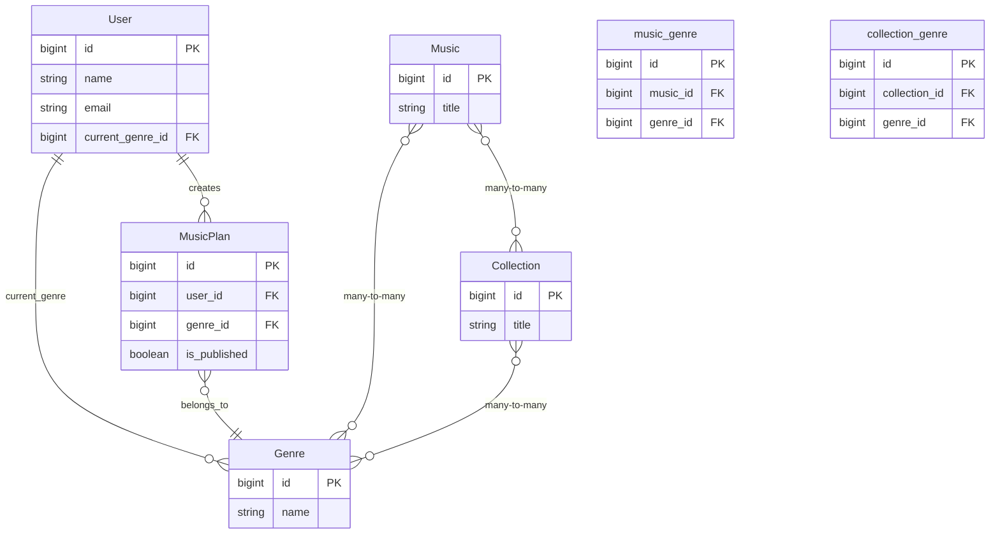

# Genre Refactor Implementation Plan

## Overview
Replace the `MusicPlanSetting` enum with a `Genre` entity to allow many-to-many relationships between Genres, Music, and Collections. Users will have a nullable `current_genre_id` foreign key.

## Current State Analysis
- `MusicPlanSetting` is an enum with values: `organist`, `guitarist`, `other`
- Used in `MusicPlan` model's `setting` field (string)
- Displayed in UI via `MusicPlanSetting::tryFrom($setting)?->label()` and icon component
- No existing many-to-many relationships with Music or Collection

## New Architecture

### Database Schema Changes

#### 1. Create `genres` table
```php
Schema::create('genres', function (Blueprint $table) {
    $table->id();
    $table->string('name')->unique(); // 'organist', 'guitarist', 'other'
    $table->timestamps();
});
```

#### 2. Create pivot tables
```php
Schema::create('music_genre', function (Blueprint $table) {
    $table->id();
    $table->foreignId('music_id')->constrained()->cascadeOnDelete();
    $table->foreignId('genre_id')->constrained()->cascadeOnDelete();
    $table->timestamps();
    
    $table->unique(['music_id', 'genre_id']);
});

Schema::create('collection_genre', function (Blueprint $table) {
    $table->id();
    $table->foreignId('collection_id')->constrained()->cascadeOnDelete();
    $table->foreignId('genre_id')->constrained()->cascadeOnDelete();
    $table->timestamps();
    
    $table->unique(['collection_id', 'genre_id']);
});
```

#### 3. Add `current_genre_id` to `users` table
```php
Schema::table('users', function (Blueprint $table) {
    $table->foreignId('current_genre_id')->nullable()->constrained('genres')->nullOnDelete();
});
```

#### 4. Update `music_plans` table
Option A: Replace `setting` with `genre_id` (preferred if deleting existing data)
```php
Schema::table('music_plans', function (Blueprint $table) {
    $table->dropColumn('setting');
    $table->foreignId('genre_id')->nullable()->constrained()->nullOnDelete();
});
```

Option B: Keep `setting` as string for backward compatibility during transition, add `genre_id` separately

### Model Changes

#### 1. Create `App\Models\Genre` model
```php
<?php

namespace App\Models;

use Illuminate\Database\Eloquent\Factories\HasFactory;
use Illuminate\Database\Eloquent\Model;
use Illuminate\Database\Eloquent\Relations\BelongsToMany;

class Genre extends Model
{
    use HasFactory;

    protected $fillable = ['name'];

    public function music(): BelongsToMany
    {
        return $this->belongsToMany(Music::class, 'music_genre');
    }

    public function collections(): BelongsToMany
    {
        return $this->belongsToMany(Collection::class, 'collection_genre');
    }

    public function users()
    {
        return $this->hasMany(User::class, 'current_genre_id');
    }

    public function musicPlans()
    {
        return $this->hasMany(MusicPlan::class);
    }

    // Methods similar to MusicPlanSetting enum
    public function label(): string
    {
        return match ($this->name) {
            'organist' => __('Organist'),
            'guitarist' => __('Guitarist'),
            'other' => __('Other'),
            default => $this->name,
        };
    }

    public function icon(): string
    {
        return match ($this->name) {
            'organist' => 'organist',
            'guitarist' => 'guitar',
            default => 'other',
        };
    }

    public function color(): string
    {
        return match ($this->name) {
            'organist' => 'blue',
            'guitarist' => 'green',
            default => 'gray',
        };
    }

    public static function options(): array
    {
        return self::all()->mapWithKeys(fn ($genre) => [
            $genre->id => $genre->label(),
        ])->toArray();
    }
}
```

#### 2. Update `App\Models\Music` model
```php
public function genres(): BelongsToMany
{
    return $this->belongsToMany(Genre::class, 'music_genre');
}
```

#### 3. Update `App\Models\Collection` model
```php
public function genres(): BelongsToMany
{
    return $this->belongsToMany(Genre::class, 'collection_genre');
}
```

#### 4. Update `App\Models\User` model
```php
protected $fillable = [
    // ... existing fields
    'current_genre_id',
];

public function currentGenre(): BelongsTo
{
    return $this->belongsTo(Genre::class, 'current_genre_id');
}
```

#### 5. Update `App\Models\MusicPlan` model
```php
protected $fillable = [
    'user_id',
    'genre_id', // replace 'setting'
    'is_published',
];

public function genre(): BelongsTo
{
    return $this->belongsTo(Genre::class);
}

// Update settingOptions() method
public static function genreOptions(): array
{
    return Genre::options();
}

// Add accessor for backward compatibility if needed
public function getSettingAttribute(): ?string
{
    return $this->genre?->name;
}
```

#### 6. Delete `App\MusicPlanSetting` enum (after all references updated)

### UI/View Updates

#### 1. Update `resources/views/components/music-plan-setting-icon.blade.php`
```blade
@php
    // Accept either Genre model or genre name
    if ($setting instanceof \App\Models\Genre) {
        $genre = $setting;
    } else {
        $genre = \App\Models\Genre::where('name', $setting)->first();
    }
    $icon = $genre?->icon() ?? 'other';
@endphp

@if($icon === 'organist')
    <x-gameicon-pipe-organ class="h-10 w-10 text-zinc-600 dark:text-zinc-600" />
@elseif($icon === 'guitar')
    <flux:icon name="guitar" class="h-10 w-10" />
@else
    <flux:icon name="musical-note" class="h-10 w-10" variant="outline" />
@endif
```

#### 2. Update all references to `MusicPlanSetting::tryFrom($setting)?->label()`
- In `⚡music-plan-card.blade.php`: Use `$musicPlan->genre?->label() ?? $musicPlan->genre?->name`
- In `⚡liturgical-info.blade.php`: Use `$plan->genre?->label() ?? $plan->genre?->name`
- In `music-plan-editor.blade.php`: Update component usage

#### 3. Update any forms that use `MusicPlan::settingOptions()`
Replace with `MusicPlan::genreOptions()` or `Genre::options()`

### Data Migration (if keeping existing data)
Since user indicated they'll delete existing data, we can:
1. Truncate relevant tables or run fresh migrations
2. Seed genres table with initial values: 'organist', 'guitarist', 'other'

### Testing Strategy

#### 1. Create tests for Genre model
```php
test('genre has correct label', function () {
    $genre = Genre::factory()->create(['name' => 'organist']);
    expect($genre->label())->toBe('Organist');
});

test('genre has many music', function () {
    $genre = Genre::factory()->create();
    $music = Music::factory()->count(3)->create();
    $genre->music()->attach($music);
    
    expect($genre->music)->toHaveCount(3);
});

test('user can have current genre', function () {
    $genre = Genre::factory()->create();
    $user = User::factory()->create(['current_genre_id' => $genre->id]);
    
    expect($user->currentGenre->id)->toBe($genre->id);
});
```

#### 2. Update existing tests
- Update `MusicPlanFactory` to use `genre_id` instead of `setting`
- Update any tests that assert on setting values

#### 3. Test UI components
- Test that genre icons display correctly
- Test that genre labels are translated

### Implementation Steps

1. **Create migrations**
   - Create genres table
   - Create music_genre pivot table
   - Create collection_genre pivot table
   - Add current_genre_id to users table
   - Update music_plans table (drop setting, add genre_id)

2. **Create Genre model and factory**
   - Create `App\Models\Genre`
   - Create `Database\Factories\GenreFactory`
   - Create `Database\Seeders\GenreSeeder` with initial values

3. **Update existing models**
   - Update Music, Collection, User, MusicPlan models

4. **Update UI components**
   - Update blade templates and components
   - Update Livewire components if they reference setting

5. **Run migrations and seed data**
   - Run migrations
   - Seed genres table

6. **Update tests**
   - Create new tests for Genre
   - Update existing tests

7. **Delete MusicPlanSetting enum**
   - Remove all references first
   - Delete `app/MusicPlanSetting.php`

8. **Verify functionality**
   - Test creating music plans with genres
   - Test assigning music to genres
   - Test user current genre selection

### Potential Issues and Mitigations

1. **Data loss**: Since user will delete existing data, no migration of existing setting values needed.

2. **Performance**: Many-to-many relationships could impact performance with large datasets. Consider eager loading where needed.

3. **Backward compatibility**: If needed during transition, keep `setting` column temporarily and add accessor/mutator to sync with `genre_id`.

4. **UI consistency**: Ensure all places that displayed setting now display genre correctly.

### Mermaid Diagram of New Relationships



### Next Steps
1. Review this plan with stakeholders
2. Begin implementation in Code mode
3. Test thoroughly before deployment
4. Update documentation if needed