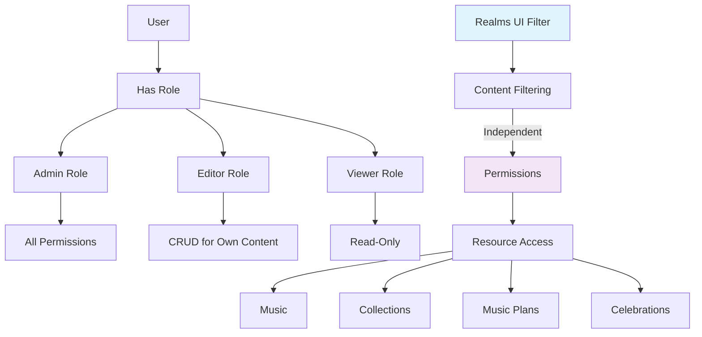

# Revised Roles and Permissions System Design

## Overview
This document outlines the revised design for implementing a comprehensive role-based permission system using Spatie Laravel Permission package. **Important Update**: Realms are NOT used in permissions. Realms are purely UI filters for genres and have no relationship to the permission system.

## Current State Analysis
- Spatie Laravel Permission package is installed but not utilized
- Admin access is determined by email matching `ADMIN_EMAIL` config
- Policies exist for core resources but use simple ownership checks
- Permission tables exist but are empty
- User model already has `HasRoles` trait
- Realms exist as a separate system for content filtering (organist, guitarist, other genres)

## Key Clarification: Realms vs Permissions
- **Realms**: UI filters for genres (organist, guitarist, other). Users (including guests) can set a realm filter to view content filtered by genre. No permission system is needed for realms.
- **Permissions**: Control access to create, read, update, delete resources. Completely separate from realms.

## Role Definitions

### 1. Admin
- **Description**: Full system access, can manage all resources and users
- **Permissions**: All permissions (except realm management permissions which don't exist)
- **Use Case**: System administrators, super users

### 2. Editor  
- **Description**: Can create and edit content, but limited to their own content
- **Permissions**: Create/read/update/delete their own content, but not system-level resources
- **Use Case**: Music directors, content managers

### 3. Viewer
- **Description**: Read-only access to content
- **Permissions**: Read permissions only
- **Use Case**: Regular users, guests with accounts

### 4. Guest (No role)
- **Description**: Unauthenticated users
- **Permissions**: Limited public access only

## Permission Matrix

### Resource-Based Permissions

#### Music Management
- `music.view` - View music pieces
- `music.create` - Create new music pieces  
- `music.update` - Update music pieces
- `music.delete` - Delete music pieces
- `music.manage` - Full management (includes all above)

#### Collection Management
- `collection.view` - View collections
- `collection.create` - Create new collections
- `collection.update` - Update collections
- `collection.delete` - Delete collections
- `collection.manage` - Full management

#### Music Plan Management
- `music-plan.view` - View music plans
- `music-plan.create` - Create new music plans
- `music-plan.update` - Update music plans  
- `music-plan.delete` - Delete music plans
- `music-plan.manage` - Full management

#### Music Plan Templates (Admin-only)
- `music-plan-template.view` - View templates
- `music-plan-template.create` - Create templates
- `music-plan-template.update` - Update templates
- `music-plan-template.delete` - Delete templates
- `music-plan-template.manage` - Full management

#### Celebration Management
- `celebration.view` - View celebrations
- `celebration.create` - Create celebrations
- `celebration.update` - Update celebrations
- `celebration.delete` - Delete celebrations
- `celebration.manage` - Full management

#### User Management (Admin-only)
- `user.view` - View users
- `user.create` - Create users
- `user.update` - Update users
- `user.delete` - Delete users
- `user.manage` - Full management

#### System Administration
- `access.admin` - Access admin panel
- `manage.roles` - Manage roles and permissions
- `system.settings` - Manage system settings

## Role-Permission Mapping

### Admin Role
- All permissions (`*`)

### Editor Role
- `music.view`, `music.create`, `music.update`, `music.delete` (own content only)
- `collection.view`, `collection.create`, `collection.update`, `collection.delete` (own content only)
- `music-plan.view`, `music-plan.create`, `music-plan.update`, `music-plan.delete` (own content only)
- `celebration.view`, `celebration.create`, `celebration.update`, `celebration.delete` (own content only)

### Viewer Role
- `music.view`
- `collection.view` 
- `music-plan.view`
- `celebration.view`

## Important: No Realm-Based Permissions
The permission system does NOT include realm-based restrictions. Realms are purely for content filtering:
- Users can filter content by realm (genre) regardless of permissions
- Permissions are checked independently of realm associations
- Content visibility in UI may be filtered by realm, but access is controlled by permissions

## Migration Strategy

### Phase 1: Database Setup
1. Create roles and permissions seeder (without realm permissions)
2. Assign admin role to existing admin users (based on current `ADMIN_EMAIL`)
3. Assign viewer role to all other existing users

### Phase 2: Policy Updates
1. Update existing policies to check roles in addition to ownership
2. **DO NOT add realm-based authorization checks** (realms are not permission-related)
3. Maintain backward compatibility during transition

### Phase 3: Middleware Updates
1. Update `AdminMiddleware` to check for `admin` role instead of email
2. Create new middleware for editor and viewer roles if needed

### Phase 4: UI Updates (Optional)
1. Add role management interface in admin panel
2. Update user management to assign roles
3. Add visual indicators for user roles

## Database Schema

The Spatie package already provides the necessary tables:
- `roles` - Role definitions
- `permissions` - Permission definitions  
- `role_has_permissions` - Role-permission mapping
- `model_has_roles` - User-role assignments
- `model_has_permissions` - Direct user-permission assignments (rarely used)

## Implementation Details

### 1. Seeder Structure (Revised - No Realm Permissions)
```php
// database/seeders/RolePermissionSeeder.php
$adminRole = Role::create(['name' => 'admin', 'guard_name' => 'web']);
$editorRole = Role::create(['name' => 'editor', 'guard_name' => 'web']);
$viewerRole = Role::create(['name' => 'viewer', 'guard_name' => 'web']);

// Create permissions for each resource (NO realm permissions)
$permissions = [
    'music' => ['view', 'create', 'update', 'delete', 'manage'],
    'collection' => ['view', 'create', 'update', 'delete', 'manage'],
    'music-plan' => ['view', 'create', 'update', 'delete', 'manage'],
    'music-plan-template' => ['view', 'create', 'update', 'delete', 'manage'],
    'celebration' => ['view', 'create', 'update', 'delete', 'manage'],
    'user' => ['view', 'create', 'update', 'delete', 'manage'],
    'system' => ['access.admin', 'manage.roles', 'system.settings'],
];

// Assign permissions to roles
$adminRole->givePermissionTo(Permission::all());
$editorRole->givePermissionTo([...]); // Editor gets CRUD for own content
$viewerRole->givePermissionTo([...]); // Viewer gets read-only
```

### 2. Policy Updates (Revised - No Realm Checks)
```php
// app/Policies/MusicPolicy.php
public function view(User $user, Music $music): bool
{
    // Admin can view anything
    if ($user->hasRole('admin')) {
        return true;
    }
    
    // Check role-based permission
    return $user->hasPermissionTo('music.view');
}

public function update(User $user, Music $music): bool
{
    // Admin can update anything
    if ($user->hasRole('admin')) {
        return true;
    }
    
    // Check if user has permission to update music
    if (!$user->hasPermissionTo('music.update')) {
        return false;
    }
    
    // For non-admin users, check ownership ONLY (no realm check)
    return $user->id === $music->user_id;
}
```

### 3. Middleware Updates
```php
// app/Http/Middleware/AdminMiddleware.php
public function handle(Request $request, Closure $next)
{
    if (! Auth::check() || ! Auth::user()->hasRole('admin')) {
        abort(403);
    }
    
    return $next($request);
}
```

## Testing Strategy

1. Update existing tests to use roles instead of email-based admin checks
2. Create new tests for role-based authorization
3. **DO NOT test realm-based permission boundaries** (realms are not permission-related)
4. Test role assignment and permission inheritance

## Backward Compatibility

To maintain compatibility during migration:
1. Keep `is_admin` attribute on User model (can be computed from roles)
2. Update existing code to use `hasRole('admin')` instead of `is_admin`
3. Provide migration path for existing admin users

## Next Steps

1. Create the database seeder with roles and permissions (without realm permissions)
2. Update User model to sync roles with existing admin status
3. Update policies to incorporate role checks (without realm checks)
4. Update middleware and route protections
5. Update tests to reflect new authorization system
6. Optional: Create admin UI for role management

## Mermaid Diagram: Permission System Architecture



**Key**: Realms (blue) are completely separate from the permission system (purple). They interact only with content filtering, not access control.