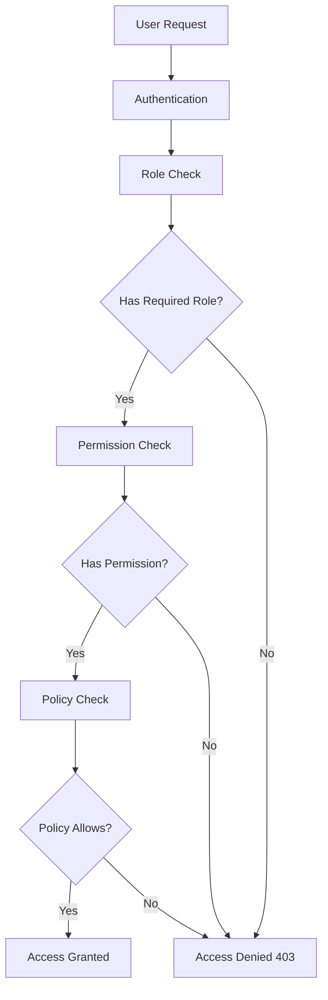

# Roles and Permissions System Documentation

## Overview
This document provides comprehensive documentation for the role-based permission system implemented in the Laravel application using the Spatie Laravel Permission package.

## Table of Contents
1. [System Architecture](#system-architecture)
2. [Roles and Permissions](#roles-and-permissions)
3. [Usage Examples](#usage-examples)
4. [Policy Implementation](#policy-implementation)
5. [Middleware Usage](#middleware-usage)
6. [Database Structure](#database-structure)
7. [Migration Guide](#migration-guide)
8. [Troubleshooting](#troubleshooting)
9. [API Reference](#api-reference)

## System Architecture

### Components
1. **Spatie Laravel Permission Package** - Core permission management
2. **User Model** - Extended with `HasRoles` trait
3. **Policies** - Updated to incorporate role checks
4. **Middleware** - Role-based route protection
5. **Database Tables** - Roles, permissions, and their relationships

### Flow Diagram


## Roles and Permissions

### Predefined Roles

#### 1. Admin
- **Description**: Full system access
- **Permissions**: All permissions
- **Use Case**: System administrators
- **Access**: All realms, all resources

#### 2. Editor
- **Description**: Content management within assigned realm
- **Permissions**: Create, read, update, delete content
- **Use Case**: Music directors, content managers
- **Access**: Only within current realm

#### 3. Viewer
- **Description**: Read-only access
- **Permissions**: Read permissions only
- **Use Case**: Regular users, guests with accounts
- **Access**: Only within current realm

### Permission Matrix

| Resource | View | Create | Update | Delete | Manage |
|----------|------|--------|--------|--------|--------|
| Music | ✓ | ✓* | ✓* | ✓* | ✓* |
| Collection | ✓ | ✓* | ✓* | ✓* | ✓* |
| Music Plan | ✓ | ✓* | ✓* | ✓* | ✓* |
| Celebration | ✓ | ✓* | ✓* | ✓* | ✓* |
| Music Plan Template | Admin only | Admin only | Admin only | Admin only | Admin only |
| User | Admin only | Admin only | Admin only | Admin only | Admin only |
| Realm | Admin only | Admin only | Admin only | Admin only | Admin only |

*✓ = Available to Editor role, * = Within assigned realm only

### System Permissions
- `access.admin` - Access admin panel
- `manage.roles` - Manage roles and permissions
- `system.settings` - Manage system settings

## Usage Examples

### Checking Roles
```php
// Check if user has a specific role
if ($user->hasRole('admin')) {
    // User is an admin
}

// Check if user has any of multiple roles
if ($user->hasAnyRole(['admin', 'editor'])) {
    // User is either admin or editor
}

// Check if user has all of multiple roles
if ($user->hasAllRoles(['admin', 'editor'])) {
    // User has both roles (unlikely but possible)
}
```

### Checking Permissions
```php
// Check direct permission
if ($user->hasPermissionTo('music.create')) {
    // User can create music
}

// Check permission via role
if ($user->can('music.create')) {
    // User can create music (checks both direct and role permissions)
}

// Multiple permissions
if ($user->hasAnyPermission(['music.create', 'music.update'])) {
    // User can create OR update music
}
```

### Assigning Roles and Permissions
```php
// Assign role to user
$user->assignRole('editor');

// Assign multiple roles
$user->assignRole(['editor', 'viewer']);

// Sync roles (replace all existing roles)
$user->syncRoles(['editor']);

// Assign direct permission
$user->givePermissionTo('music.create');

// Remove role
$user->removeRole('editor');

// Remove permission
$user->revokePermissionTo('music.create');
```

### In Blade Templates
```blade
{{-- Check role --}}
@if(auth()->user()->hasRole('admin'))
    <a href="{{ route('admin.dashboard') }}">Admin Dashboard</a>
@endif

{{-- Check permission --}}
@can('music.create')
    <button>Create Music</button>
@endcan

{{-- Multiple permissions --}}
@hasanypermission(['music.create', 'music.update'])
    <div>Can create or update music</div>
@endhasanypermission
```

## Policy Implementation

### Policy Structure
Policies now check both roles and ownership:

```php
// app/Policies/MusicPolicy.php
public function view(User $user, Music $music): bool
{
    // Admin can view anything
    if ($user->hasRole('admin')) {
        return true;
    }
    
    // Check permission
    if (! $user->hasPermissionTo('music.view')) {
        return false;
    }
    
    // Realm check (if applicable)
    if ($music->realm_id && $user->current_realm_id !== $music->realm_id) {
        return false;
    }
    
    return true;
}

public function update(User $user, Music $music): bool
{
    // Admin can update anything
    if ($user->hasRole('admin')) {
        return true;
    }
    
    // Check permission
    if (! $user->hasPermissionTo('music.update')) {
        return false;
    }
    
    // Ownership check
    if ($user->id !== $music->user_id) {
        return false;
    }
    
    // Realm check
    if ($music->realm_id && $user->current_realm_id !== $music->realm_id) {
        return false;
    }
    
    return true;
}
```

### Policy Registration
Policies are automatically discovered by Laravel. Ensure models have policies in `app/Policies/` directory.

## Middleware Usage

### Admin Middleware
```php
// routes/admin.php
Route::middleware(['auth', 'verified', 'admin'])->prefix('admin')->group(function () {
    // Admin-only routes
});

// app/Http/Middleware/AdminMiddleware.php
public function handle(Request $request, Closure $next)
{
    if (! Auth::check() || ! Auth::user()->hasRole('admin')) {
        abort(403);
    }
    
    return $next($request);
}
```

### Custom Middleware Examples
```php
// Editor middleware
Route::middleware(['auth', 'editor'])->group(function () {
    // Editor-only routes
});

// Permission middleware
Route::middleware(['auth', 'permission:music.create'])->group(function () {
    // Routes requiring specific permission
});
```

## Database Structure

### Tables
1. **roles** - Role definitions
   - `id`, `name`, `guard_name`, `created_at`, `updated_at`
2. **permissions** - Permission definitions
   - `id`, `name`, `guard_name`, `created_at`, `updated_at`
3. **role_has_permissions** - Role-permission relationships
   - `permission_id`, `role_id`
4. **model_has_roles** - User-role assignments
   - `role_id`, `model_type`, `model_id`
5. **model_has_permissions** - Direct user-permission assignments
   - `permission_id`, `model_type`, `model_id`

### Seeding
```bash
# Run the seeder
php artisan db:seed --class=RolePermissionSeeder

# Or include in DatabaseSeeder
$this->call(RolePermissionSeeder::class);
```

## Migration Guide

### From Email-Based to Role-Based System

#### Step 1: Database Migration
```bash
php artisan migrate
```

#### Step 2: Seed Roles and Permissions
```bash
php artisan db:seed --class=RolePermissionSeeder
```

#### Step 3: Update Code
1. Replace `$user->is_admin` with `$user->hasRole('admin')`
2. Update policies to include role checks
3. Update tests to assign roles to test users

#### Step 4: Verify
1. Test admin access still works
2. Test regular user permissions
3. Run existing tests to ensure compatibility

### Backward Compatibility
The system maintains backward compatibility:
- `$user->is_admin` still works (checks both email and role)
- Existing admin users automatically get admin role
- Policies check both old and new authorization methods

## Troubleshooting

### Common Issues

#### 1. "Role does not exist" Error
```php
// Solution: Ensure role exists before assigning
use Spatie\Permission\Models\Role;

Role::firstOrCreate(['name' => 'admin', 'guard_name' => 'web']);
$user->assignRole('admin');
```

#### 2. Permissions Not Working After Role Assignment
```php
// Solution: Clear permission cache
app()[\Spatie\Permission\PermissionRegistrar::class]->forgetCachedPermissions();
```

#### 3. Policy Not Recognizing Roles
```php
// Ensure User model uses HasRoles trait
use Spatie\Permission\Traits\HasRoles;

class User extends Authenticatable
{
    use HasRoles;
    // ...
}
```

#### 4. Testing Issues
```php
// In tests, ensure roles exist
protected function setUp(): void
{
    parent::setUp();
    Role::firstOrCreate(['name' => 'admin', 'guard_name' => 'web']);
}
```

### Debugging Commands
```bash
# List all roles and permissions
php artisan permission:show

# Create a role
php artisan permission:create-role admin

# Create a permission  
php artisan permission:create-permission "music.create"

# Assign role to user
php artisan permission:assign-role admin user@example.com
```

## API Reference

### User Model Methods

#### Role Methods
```php
// Check roles
$user->hasRole($role); // Single role
$user->hasAnyRole($roles); // Array of roles
$user->hasAllRoles($roles); // All roles in array
$user->getRoleNames(); // Get all role names

// Manage roles
$user->assignRole($role);
$user->removeRole($role);
$user->syncRoles($roles);
$user->getRoleNames();
```

#### Permission Methods
```php
// Check permissions
$user->hasPermissionTo($permission);
$user->hasAnyPermission($permissions);
$user->hasAllPermissions($permissions);
$user->can($ability); // Gate check

// Manage permissions
$user->givePermissionTo($permission);
$user->revokePermissionTo($permission);
$user->syncPermissions($permissions);
```

#### Helper Methods
```php
$user->is_admin; // Backward compatibility
$user->getRoleNamesAttribute(); // Array of role names
$user->hasAnyRole(['admin', 'editor']); // Convenience method
```

### Role Model Methods
```php
$role = Role::findByName('admin', 'web');
$role->givePermissionTo($permission);
$role->revokePermissionTo($permission);
$role->syncPermissions($permissions);
$role->hasPermissionTo($permission);
```

### Permission Model Methods
```php
$permission = Permission::findByName('music.create', 'web');
$permission->assignRole($role);
$permission->removeRole($role);
```

## Best Practices

### 1. Use Policies for Complex Logic
- Keep authorization logic in policies
- Use role checks as first line of defense
- Add ownership and realm checks after role checks

### 2. Prefer Role-Based over Direct Permissions
- Assign permissions to roles, not directly to users
- Create custom roles for specific use cases
- Use direct permissions only for exceptional cases

### 3. Cache Considerations
- Permission caching improves performance
- Clear cache after role/permission changes
- Use `forgetCachedPermissions()` in seeders

### 4. Testing
- Create test helpers for role assignment
- Test all role combinations
- Include realm-based authorization tests

### 5. Security
- Regularly audit role assignments
- Limit admin role assignments
- Monitor permission changes

## Extension Points

### Custom Roles
```php
// Create custom role
$customRole = Role::create([
    'name' => 'music-director',
    'guard_name' => 'web',
    'description' => 'Can manage music but not other resources',
]);

// Assign specific permissions
$customRole->givePermissionTo([
    'music.view',
    'music.create', 
    'music.update',
    'music.delete',
    'music-plan.view',
    'music-plan.create',
]);
```

### Realm Integration
```php
// Extend policies for realm-based access
public function view(User $user, Music $music): bool
{
    if ($user->hasRole('admin')) {
        return true;
    }
    
    // Realm-based restriction
    if ($user->current_realm_id !== $music->realm_id) {
        return false;
    }
    
    return $user->hasPermissionTo('music.view');
}
```

### Event Listeners
```php
// Listen for role/permission changes
Event::listen(RoleAttached::class, function ($event) {
    Log::info('Role attached', [
        'user_id' => $event->user->id,
        'role' => $event->role->name,
    ]);
});
```

## Conclusion

The role-based permission system provides:
1. **Flexible authorization** with roles and permissions
2. **Backward compatibility** with existing email-based admin system
3. **Realm-based restrictions** for multi-tenant support
4. **Comprehensive testing** support
5. **Extensible architecture** for future requirements

For questions or issues, refer to:
- [Spatie Laravel Permission Documentation](https://spatie.be/docs/laravel-permission/v6/introduction)
- [Laravel Authorization Documentation](https://laravel.com/docs/authorization)
- Application-specific policies in `app/Policies/`